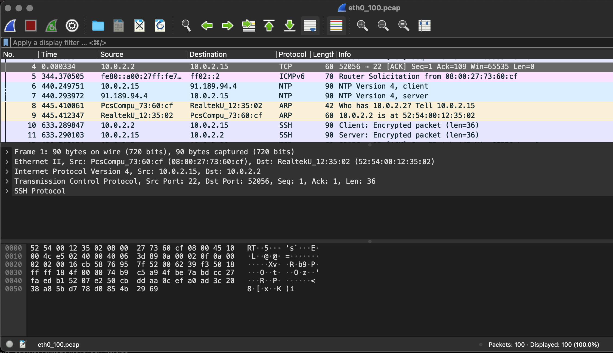

# 1.1. Введение в DevOps — Аронов Леонид
***
## Задание №2 - Описание жизненного цикла задачи (разработки нового функционала)

* ### Формулировка описания нового функционала
  <p>Продукт-менеджер совместно с клиентом или отделом маркетологов формулирует описание нового функционала.</p>
  <p>Реузльтатом их работы является набросок в Figma и словесное описание функционала (use-cases).</p>
* ### Оценка времени реализации нового функционала 
  <p>Проджект-менеджер с помощью тим-лида или непосредственно общаясь с командой разработчиков оценивает время, необходимое на реализацию нового функционала.</p>
  <p>Полученная оценка времени согласуется с продукт-менеджером и клиентом/заказчиком/маркетологами.</p>
* ### Проектирование/доработка текущего проека в части нового функционала
  <p>Проджект-менеджер возможно совместно с тим- и тех-лидом проектирует новый функционал в части входных выходных интерфесов, стараясь не нарушить логику того, что уже есть</p>
  <p>DevOps-инженер согласует с проджект-менеджером инфраструктуру для работы над проектом:
  
    - необходимый набор серверов внутри организации или облачных сервисов;
    - настраивает pipeline, runner'ы и все такое, что позволяет в автоматическом режиме создавать изолированное окружение, его инициализацию, запуск тестов, логирование результатов тестов и мониторинг
    - согласует с командой разработчиков аспекты их работы, затрагивающие CI/CD, чтобы все всё одинаково понимали, помогает им с настройкой среды разработки, снабжает команду разработчиков необходимыми токенами/паролями/ключами/креденшелзами, чтобы они могли выкатывать свой продукт в репозиторгий и pipeline
    - настраивает инфраструктуру в части сохранности рабочего кода (веток/коммитов), возможности отката назад
  </p>
* ### Работа над проектом
  <p>После согласования проджект-менеджер составляет roadmap, планирует первые и следующий спринты, если принята такая модель работы над проектом.</p>
  <p>Команда разработчиком работает по спринтам, а DevOps следят за тем, что настроенная ими инфраструктура позволяет делать то, что должна делать</p>
  <p>DevOps следит за результатами работы команды разработчиков, состоянием всяких секретов, необходимых для dev и prod</p>
  <p>DevOps заряжает свой ноутбук перед сном, чтобы быть готовым в любой момент по логам удаленных серверов перезапустить runner'ы и прочие сервисы автоматизации, прочитать документацию очередного обновления Kubernetes, чтобы вернуть кластер в рабочий режим, или заказать еще мощностей для масштабирования после того, как разработчики выкатили фитчу на тему AR</p>
  <p>DevOps перечитывает книжки дядюшки Боба, чтобы не налепить монстра на кастылях, а сделать все как надо. Ведь инфраструктура - это тоже проект со своей структурой и арзитектурой, все должно быть на своих местах!</p>

* ### Выкат нового функционала потребителю
  <p>Команда разработчиков делает финальный ручной мердж в master, все проходит ожидаеме гладко, срабатывает сценарий выкатки новой версии продукта.</p>
  <p>Пока все работает в автоматическом режиме, DevOps отвечает на вопросы в stackoverflow, сабмитит свои новые идеи разработчикам используемых им инструментов, пишет свои супер-скрипты на питоне или bash, изучает новые инструменты (Pulumi?).</p>


<details>
<summary><strong>P.S.</strong></summary>
Вообще не имея некоторого опыта в области CI/CD, по материалам первого вебинара, на мой взгляд, очень сложно внятно сформулировать аспекты роли devops'а, ведь их надо буквально додумывать самостоятельно, а это уже не обучение, а скорее личный опыт.
Простите за возможно необоснованную критику, может я пока еще что-то не так понимаю, но к концу курса, надеюсь, все пойму и все смогу:)
</details>


# Материалы домашнего задания на тему «2.1. Системы контроля версий.»
1. Добавили что-то в файл README.md и посмотрели на вывода команды
```bash
git status
```
2. Проверили вывод команды `git diff` и `git diff --staged`. Первая выводит разницу между текущим (модифицированным) состоянием файла.
Вторая команда показала разницу между подготовленными к комиту изменениями (staged) и уже закомиченным (в HEAD) состоянием. 
Т.к. новые изменения не были переведены в состояние staged, то вывод был пустой.
3. Добавили изменения в следующий коммит. Теперь вывод команд поменялся: `git diff` не показывает ничего, `git diff --staged` показывает то, что было измененено, но еще не закомичено.

   **Пришлось воспользоваться командой `git rebase`, чтобы вставить коммит в историю версий, т.к. забыл указать сообщение к коммиту в соответствии с заданием. Возникшие конфликты мерджа поправил вручную**
4. Подготовили папку для конфигурации terraform, создали там локальный .gitignore, в котором задали следующие настройки для git'а:
   1. не индексировать подпапки и их содержимое с именем `.terraform` на любом уровне вложенности
   2. не индексировать файлы с расширением `.tfstate` на любом уровне вложенности
   3. не индексировать файлы, в имени которых есть строка `.tfstate.` на любом уровне вложенности
   4. не индексировать файлы с именем crash.log на любом уровне вложенности
   5. не индексировать файлы с расширением `.tfvars` на любом уровне вложенности
   6. не индексировать файлы с именами `override.tf`, `override.tf.json`, а также заканчивающиеся на `_override.tf`, и `_override.tf.json`
   7. не индексировать файлы с именами `.terraformrc` и `terraform.rc`

**Эти настройки работают только относительно папки /terraform и ее подпапок**

# Merge and  Rebase
1. Эксперимент с rebase
2. Приступили к изучению слияний, мержев и ребейза


# Домашнее задание к занятию "3.1. Работа в терминале, лекция 1"

п.8 
- Q1: какой переменной можно задать длину журнала history, и на какой строчке manual это описывается?
  - A1.1: Имя переменной HISTSIZE
  - A1.2: Описание переменной начинается со строки 1178 из 6175

- Q2: что делает директива ignoreboth в bash?
  - A2: HISTCONTROL\
              A colon-separated list of values controlling how commands are saved on the history list.  If the list of values includes ignorespace, lines which begin with a space character are not saved in the history list.  A value
              of ignoredups causes lines matching the previous history entry to not be saved.  A value of ignoreboth is shorthand for ignorespace and ignoredups.  A value of erasedups causes all previous lines matching  the  current
              line to be removed from the history list before that line is saved.  Any value not in the above list is ignored.  If HISTCONTROL is unset, or does not include a valid value, all lines read by the shell parser are saved
              on the history list, subject to the value of HISTIGNORE.  The second and subsequent lines of a multi-line compound command are not tested, and are added to the history regardless of the value of HISTCONTROL.
  - Судя по всему ignoreboth - это ключ, который указывается среди прочих в переменной окружения HISTCONTROL и указывает оболочке не записывать в историю команды, начинающиеся с пробела, а также не дублировать в истории одинаковые команды идущие подряд.

п.9
- Q: В каких сценариях использования применимы скобки {} и на какой строчке man bash это описано?
  - A: { list; }\
              list  is  simply  executed in the current shell environment.  list must be terminated with a newline or semicolon.  This is known as a group command.  The return status is the exit status of list.  Note that unlike the
              metacharacters ( and ), { and } are reserved words and must occur where a reserved word is permitted to be recognized.  Since they do not cause a word break, they must be separated from list by  whitespace  or  another
              shell metacharacter.
  - Это синтаксис для выполнения списка (list) команд в ТЕКУЩЕМ окружении.
  - Описание начинается на строке 196 из 3219

п.10
- Q: С учётом ответа на предыдущий вопрос, как создать однократным вызовом touch 100000 файлов? Получится ли аналогичным образом создать 300000? Если нет, то почему?
  - A1: touch {1..100000}
  - A2: Нельзя. В настройках limits.h через соотношение константы ARG_MAX и размера стека определяется максимальное число допустимых аргументов для функции (так говорит google). Можно поробовать через цикл.

п.11
- Q: В man bash поищите по /\[\[. Что делает конструкция [[ -d /tmp ]]
  - A: `[[ expr ]]` - это проверка `expr` на соответствие True/False. Возвращает 0 или 1. Выражение `-d/tmp` для test проверяет, существует ли файл /tmp и является ли он директорией (опять же без гугла чисто по man, я бы долго доходил до man test).

п.12
- Q: Основываясь на знаниях о просмотре текущих (например, PATH) и установке новых переменных; командах, которые мы рассматривали, добейтесь в выводе type -a bash в виртуальной машине наличия первым пунктом в списке:
```bash
bash is /tmp/new_path_directory/bash
bash is /usr/local/bin/bash
bash is /bin/bash
```
  - A: 
```bash
mkdir -p /tmp/new_path_directory/
cp /usr/local/bin/bash /tmp/new_path_directory/bash
PATH=/tmp/new_path_directory:$PATH
```

п.13
- Q: Чем отличается планирование команд с помощью batch и at?
  - A: `at`      executes commands at a specified time. (запуск команд из файла в определенное время)\
       `batch`   executes commands when system load levels permit; in other words, when the load average drops below 1.5, or the value specified in the invocation of atd. (запуск команд из файла, когда уровень загрузки системы позволяет это сделать). Уровень загрузки системы - это системный показатель, метрика (опять же гугл).


# Домашнее задание к занятию "3.2. Работа в терминале, лекция 2"

Q1: Какого типа команда cd? Попробуйте объяснить, почему она именно такого типа; опишите ход своих мыслей, если считаете что она могла бы быть другого типа.\
A1: 
```bash
type cd
cd is a shell builtin
```
Команда cd - это команда, встроенная в оболочку (shell). Ее назначение - изменять текущую директорию в соответствии с аргументом команда. Оболочка является программой для общения с ядром *'nix. На просторах интернета пишут, что команды, которые так или иначе изменяют состояние оболочки, очевидно, должны быть встроенными (подозреваю, что тут речь о правильном проектировании, области видимости и безопасности). Мои личные соображения: некоторые команды должны быть частью оболочки по принципу "минимального набора инструментов": перейти в директорию, где лежат скрипты, чтобы эти скрипты запустить.

Q2: Какая альтернатива без pipe команде grep <some_string> <some_file> | wc -l? man grep поможет в ответе на этот вопрос. Ознакомьтесь с документом о других подобных некорректных вариантах использования pipe.\
A2: 
```bash
grep -c <some_string> <some_file>
```
Отдельное спасибо за материалы на тему Useless Use of &lt;some bash&gt;.

Q3: Какой процесс с PID 1 является родителем для всех процессов в вашей виртуальной машине Ubuntu 20.04?\
A3: Это процесс systemd или init (расположение в системе /sbin/init). Вот что говорит про этот процесс man /sbin/init:
- systemd is a system and service manager for Linux operating systems. When run as first process on boot (as PID 1), it acts as init system that brings up and maintains userspace services. Separate instances are started for
       logged-in users to start their services.
- Т.е. это менеджре систем и сервисов. Это тот процесс, который загружается первым при старте Linux. Он инициализирует рабочее окружение (сервисы) каждого пользователя. При этом для каждого залогиневшегося в систему пользователя запускается свой экземпляр сервиса systemd/init.

Q4: Как будет выглядеть команда, которая перенаправит вывод stderr ls на другую сессию терминала?
A4: 
```bash
<'ls' comand use> 2>/dev/ttys003
```
пример для теста
```bash
ls -y 2>/dev/ttys003
```
В этом примере я обращаюсь к команде `ls` с недопустимым ключом `-y` и перенаправляют вывод stderr (его дескриптор - 2) на устройство терминала, которое в моей текущей сессии зарезервировано за терминалом виртуальной машины с сессией Ubuntu.

Q5: Получится ли одновременно передать команде файл на stdin и вывести ее stdout в другой файл? Приведите работающий пример.\
A5: Не уверен, что правильно понял комментарий преподавателя. Update:
```bash
cat file > <comand> > new_file
```
Пример:
```bash
cat file > echo > new_file
```

Q6: Получится ли находясь в графическом режиме, вывести данные из PTY в какой-либо из эмуляторов TTY? Сможете ли вы наблюдать выводимые данные?\
A6: Либо я чего-то не понял, либо ответ на этот вопрос дается решением на вопрос №4. Находясь в псевдотерминале (PTY) можно сформировать команду, в которой поток вывода перенаправлен на другое устройство. В качестве этого другого устройства достаточно выбрать соответствующий файл в /dev/tty***. Вопрос только в том, что доступно (область видимости) из текущей сессии. Увидеть результат вывода можно, естественно в том терминале, куда передан вывод, в текущем терминале не будет ничего.

Q7: Выполните команду bash 5>&1. К чему она приведет? Что будет, если вы выполните echo netology > /proc/$$/fd/5? Почему так происходит?\
A7: `bash 5>&1` приводит к созданию в текущей сессисии нового файлового дескриптора с номером 5 (его расположение в системе /proc/$$/fd/5, здесь $$ - это ссылка на процесс текущей сессии). Дополнительно вывод через этот файловый дескриптор перенаправляется на stdout текущей сесси. Поэтому команда `echo netology > /proc/$$/fd/5` просто передает строку `netology` в файловый дескриптор 5, а оттуда строка уже перенаправляется в stdout. Результат тот же, что и от команды `echo netology`.

Q8: Получится ли в качестве входного потока для pipe использовать <b><u>только</u></b> stderr команды, не потеряв при этом отображение stdout на pty? Напоминаем: по умолчанию через pipe передается только stdout команды слева от | на stdin команды справа. Это можно сделать, поменяв стандартные потоки местами через промежуточный новый дескриптор, который вы научились создавать в предыдущем вопросе.\
A8: Update после комментариев преподавателя:
```bash
<comand1> 3>&1 1>&2 2>&3 3>&- | <comand2>
```
I want to be a nice citizen (почитвать [тут](https://catonmat.net/bash-one-liners-explained-part-three))

Q9: Что выведет команда cat /proc/$$/environ? Как еще можно получить аналогичный по содержанию вывод?
A9: Команда выводит перечень переменных окружения и их значения для текущего ($$) процесса. При этом этот перечень соответствует состоянию, когда процесса только запускался. Похожу информацию можно получить, набрав в cmd `env` (/usr/bin/env) с той разницей, что там будут не только те переменные, с которыми была запущена сессия, но новые переменные, определенные во время сессии.

Q10: Используя man, опишите что доступно по адресам /proc/<PID>/cmdline, /proc/<PID>/exe.
A10: 
- По адресу `/proc/<PID>/cmdline` доступно представление команды, с помощью которой порожден процесс с pid=\<PID\>. К зомби-процессам это не относится, для них тут будет пусто (так пишут)
- По адресу `/proc/<PID>/exe` доступна символьная ссылка, содержащаю путь к команде, породившей процесс. То есть по этому адресу можно создать еще одгну копию процесса. 

Q11: Узнайте, какую наиболее старшую версию набора инструкций SSE поддерживает ваш процессор с помощью /proc/cpuinfo\
A11: 
- sse 
- sse2
- sse4_1
- sse4_2
man говорит, что `lscpu` тоже можно загрепать на этот вопрос.

Q12: При открытии нового окна терминала и vagrant ssh создается новая сессия и выделяется pty. Это можно подтвердить командой tty, которая упоминалась в лекции 3.2. Однако:
```bash
vagrant@netology1:~$ ssh localhost 'tty'
not a tty
```

Почитайте, почему так происходит, и как изменить поведение.

A12: Из того, что видел в интернетах и из того, что встретилось в задаче 4 текущего ДЗ могу сделать такой вывод. При создании ssh сессии в хост-машине выделяется tty и связывается с pty в удаленной машине. Если дальше в удаленной машине попытаться создать еще одну ssh-сессию (соединение), то в рамках текущей ssh-сессии нельзя будет выделить tty, т.к. его там нет.
??: Смущает следующее: ssh localhost позволяет создать-таки ssh-сессию (пришлось подобрать пароль - `vagrant`) и тогда создается еще один pty и в рамках этой вложенной ssh-сессии команжа `tty` честно выдает его pts. И команда `w` тоже показывает два pty. Я подумаю об этом потом.\
Update: Вариант `ssh -t ...` тоже пробовал и видел, как вариант обхода сообщения `not a tty`.

Q13: Бывает, что есть необходимость переместить запущенный процесс из одной сессии в другую. Попробуйте сделать это, воспользовавшись reptyr. Например, так можно перенести в screen процесс, который вы запустили по ошибке в обычной SSH-сессии.\
A13: Что-то получилось после правки /etc/sysctl.d/10-ptrace.conf и ребута виртуальной машины. Но кейсы использования утилиты (пришлось его доставлять в виртуалку) неясны даже из матуала:()

Q14: sudo echo string > /root/new_file не даст выполнить перенаправление под обычным пользователем, так как перенаправлением занимается процесс shell'а, который запущен без sudo под вашим пользователем. Для решения данной проблемы можно использовать конструкцию echo string | sudo tee /root/new_file. Узнайте что делает команда tee и почему в отличие от sudo echo команда с sudo tee будет работать.\
A14: 
- sudo echo string > /... = сначала вызвает echo и редирект (т.е. под текущим пользователем, eще не под sudo) и ограничен в доступе к /root
- tee читает stdin и записывает в stdout или файл, соответственно sudo tee выполняется под sudo, поэтому этот процесс уже имеет доступ к /root


# Домашнее задание на тему "3.3. Операционные системы, лекция 1"

Q1: Какой системный вызов делает команда cd? В прошлом ДЗ мы выяснили, что cd не является самостоятельной программой, это shell builtin, поэтому запустить strace непосредственно на cd не получится. Тем не менее, вы можете запустить strace на /bin/bash -c 'cd /tmp'. В этом случае вы увидите полный список системных вызовов, которые делает сам bash при старте. Вам нужно найти тот единственный, который относится именно к cd. Обратите внимание, что strace выдаёт результат своей работы в поток stderr, а не в stdout.\
A1: Несмотря на формулировку вопроса, анализируя вывод предоагаемой команды, я увидел ДВА системных вызова:
- stat -> сначала была запрошена статистика по файлу, путь к которому передается команде cd в качестве аргумента;
- chdir -> собственно изменить рабочую директорию

Q2: Попробуйте использовать команду file на объекты разных типов на файловой системе. Например:
```bash
vagrant@netology1:~$ file /dev/tty
/dev/tty: character special (5/0)
vagrant@netology1:~$ file /dev/sda
/dev/sda: block special (8/0)
vagrant@netology1:~$ file /bin/bash
/bin/bash: ELF 64-bit LSB shared object, x86-64
```
Используя strace выясните, где находится база данных file на основании которой она делает свои догадки.\
A2: 
- Команда file делает системный вызов lstat, в ответ на который получает ответ, содержащий в том числе данные о типе файла в виде битовой маски в поле st_mode. Так же содержатся и данные о правах доступа (file mode and permission control).
- openat пытается найти файл для расшифровки по нескольким адресам: "/etc/magic.mgc", "/etc/magic", "/usr/share/misc/magic.mgc"). Но незная, что надо искать что-то магическое (magic), я бы в жизни не ответил на этот вопрос, т.к. openat чего только не открывает.

Q3: Предположим, приложение пишет лог в текстовый файл. Этот файл оказался удален (deleted в lsof), однако возможности сигналом сказать приложению переоткрыть файлы или просто перезапустить приложение – нет. Так как приложение продолжает писать в удаленный файл, место на диске постепенно заканчивается. Основываясь на знаниях о перенаправлении потоков предложите способ обнуления открытого удаленного файла (чтобы освободить место на файловой системе).\
A3.1: 
- определяем файловый дескриптор удаленного файла по его имени (`ls -la /proc/<pid>/fd`)
- перенаправляем файловый дескриптор в /dev/null\
- 
A3.2: (хотел бы получить обратную связь по еще одному варианту решения проблемы)
- определеяем <pid> попавшего в западню процесса
- определяем файловый дескриптор удаленного файла по его имени (`ls -la /proc/<pid>/fd`)
- вызываем strace -p <pid> -e trace=write. В выводе strace находим write, которые пытается сливать буффер в уже удаленный файл. Нужен write, который у которого в первом аргумент дескриптор удаленного файла.
- вызываем strace -p <pid> inject=write:error=EBADF - т.е. добавляем в вызов ошибку. Надо только как-то аккуратно выбрать нужный write через, например, when.
p.s. Я первый раз знакомлюсь со всей этой темой, поэтому пока просто фантазирую на основе прочитанных мануалов и статей. Всегда стараюсь найти больше 1 решения.

Q4: Занимают ли зомби-процессы какие-то ресурсы в ОС (CPU, RAM, IO)?\
A4: Нет, согласно определению зомби-процесса. Такой процесс занимает место только в таблице процессов, что может при большом числе процессов привести к блокировке сессии, т.к. больше места для новых процессов нет.

Q5: В iovisor BCC есть утилита opensnoop:
```bash
root@vagrant:~# dpkg -L bpfcc-tools | grep sbin/opensnoop
/usr/sbin/opensnoop-bpfcc
```
На какие файлы вы увидели вызовы группы open за первую секунду работы утилиты? Воспользуйтесь пакетом bpfcc-tools для Ubuntu 20.04. Дополнительные сведения по [установке](https://github.com/iovisor/bcc/blob/master/INSTALL.md).

A5: Предлагаемый BPF-скрипт показал, что системный вызов open() циклически обращается к следующему списку файлов
```bash
PID    COMM               FD ERR PATH
835    vminfo              6   0 /var/run/utmp
586    dbus-daemon        -1   2 /usr/local/share/dbus-1/system-services
586    dbus-daemon        18   0 /usr/share/dbus-1/system-services
586    dbus-daemon        -1   2 /lib/dbus-1/system-services
586    dbus-daemon        18   0 /var/lib/snapd/dbus-1/system-services/
1      systemd            12   0 /proc/560/cgroup
1      systemd            12   0 /proc/610/cgroup
835    vminfo              6   0 /var/run/utmp
586    dbus-daemon        -1   2 /usr/local/share/dbus-1/system-services
586    dbus-daemon        18   0 /usr/share/dbus-1/system-services
586    dbus-daemon        -1   2 /lib/dbus-1/system-services
586    dbus-daemon        18   0 /var/lib/snapd/dbus-1/system-services/
604    irqbalance          6   0 /proc/interrupts
604    irqbalance          6   0 /proc/stat
604    irqbalance          6   0 /proc/irq/20/smp_affinity
604    irqbalance          6   0 /proc/irq/0/smp_affinity
604    irqbalance          6   0 /proc/irq/1/smp_affinity
604    irqbalance          6   0 /proc/irq/8/smp_affinity
604    irqbalance          6   0 /proc/irq/12/smp_affinity
604    irqbalance          6   0 /proc/irq/14/smp_affinity
604    irqbalance          6   0 /proc/irq/15/smp_affinity
```
p.s. Надо потом погуглить, что за файловый дескриптор -1.

Q6: Какой системный вызов использует uname -a? Приведите цитату из man по этому системному вызову, где описывается альтернативное местоположение в /proc, где можно узнать версию ядра и релиз ОС.\
A6: 
- Используется одноименный системный вызов uname(2). 
- Цитата строки 50 из 63:
```bash
Part of the utsname information is also accessible via /proc/sys/kernel/{ostype, hostname, osrelease, version, domainname}. 
```

Q7: Чем отличается последовательность команд через ; и через && в bash? Например:
```bash
root@netology1:~# test -d /tmp/some_dir; echo Hi
Hi
root@netology1:~# test -d /tmp/some_dir && echo Hi
root@netology1:~#
```
Есть ли смысл использовать в bash &&, если применить set -e?\
A7: 
- Оба символа (; и &&) позволяют разделить последовательность команд, чтобы задать их выполнение одной строкой. Разница заключается в том, что
  - в случае \<comand1>; \<comand2> обе команда просто выполнятся одна за другой независимо от результата выполнения команды \<comand1>
  - в случае \<comand1> && \<comand2> команда \<comand2> выполнится только в случае успешного (штатного) завершения команды \<comand1>. Иными словами, && - это логическое ИЛИ между двумя командами. Успешность выполнения команды определяется ее exit-кодом.
- set позволяет изменить настройки bash, в частности ключ -e настраивает сессию так, что bash-скрипт (последовательность команд) прекращает свое выполнение в случае, если одна из команд завершилась с ненулевым exit-кодом. Цитата из set --help: Exit immediately if a command exits with a non-zero status. Таким образом, если применить set -e, то использование && никак не изменит ход выполнения скрипта (последовательности команд).

Q8: Из каких опций состоит режим bash set -euxo pipefail и почему его хорошо было бы использовать в сценариях.\
A8: Разберем набор ключей, настраивающих оболочку bash согласно содержанию вопроса:
- `-e` этот ключ мы уже разобрали в вопросе 7 - немедленно прекращать выполнение скрипта, если команда завершилась ненулевым кодом;
- `-u` = nounset. В мане, на удивление, нет развернутого описания, но гугл подсказывает, что в этом случае скрипт завершится, если будет попытка обратиться к необъявленной переменной;
- `-x` = xtrace. Опять в мане очень мало. Опять гугл: делать трассировку того, что выполняется в скрипте - полезно для дебага;
- `-o` позволяет задать настройку не через ключ, а через полное имя опции. В данному слачае, это опция `pipefail`;
- `pipefail` = the return value of a pipeline is the status of the last command to exit with a non-zero status, or zero if no command exited with a non-zero status. Переведу это как: При использовании pipeline, возвращаемое им значение соответствует статусу (exit-коду) последней команды с ненулевым exit-кодом. Если же все команды в pipeline выполнились успешно, то pipeline завершается нулевым exit-кодом. Так, видимо, можно быть уверенным, что все команды в pipeline выполнились успешно.\
Таким образом, предалагаемый набор настроек для bash очень удобен для дебага скрипта: выходим из скрипта в случае любой ошибки, трейсим все, что выполнилось.

Q9: Используя -o stat для ps, определите, какой наиболее часто встречающийся статус у процессов в системе. В man ps ознакомьтесь (/PROCESS STATE CODES) что значат дополнительные к основной заглавной буквы статуса процессов. Его можно не учитывать при расчете (считать S, Ss или Ssl равнозначными).\
A9: 
- В виртуальной машине Ubuntu (кстати, обратная связь авторам курса: лучше прямо скажите, что установка VirtualBox - хороший и простой вариант, дающий возможность выполнять ДЗ, а то мы в чатике переругались все на тему, зачем нам VirtualBox, если есть контейнеры. Пусть VirtualBox будет как PyCharm - инструментом)... так вот, в виртуальной машине у меня всего два процесса: собственно терминал со статусом S - interruptible sleep (waiting for an event to complete), и ps - со статусом R - running or runnable (on run queue).
- А вот в host-машине MacOs оказалось: что самый популярный статус процесса - это S, а еще там почему-то не было самого ps, если загрепать, то grep ps есть как процесс, а чистого ps нет:()
Update:
- после комментариев сделал так:
```bash
ps -eo stat | grep S | wc -l \\ получил 56
```
```bash
ps -eo stat | grep I | wc -l \\ получил 59
```
```bash
ps -eo stat | grep R | wc -l \\ получил 1
```

Итого, в виртуалке с небольшим отрывом лидируют I - Idle kernel thread. Проверка делалась на свежезагруженной ОС, поэтому среди процессов наиболее распространены процессы ядра в режиме ожидания.

P.s. интересная домашка, спасибо!

# Домашнее задание к занятию "3.4. Операционные системы, лекция 2"

Q1:На лекции мы познакомились с node_exporter. В демонстрации его исполняемый файл запускался в background. Этого достаточно для демо, но не для настоящей production-системы, где процессы должны находиться под внешним управлением. Используя знания из лекции по systemd, создайте самостоятельно простой unit-файл для node_exporter:
- поместите его в автозагрузку,
- предусмотрите возможность добавления опций к запускаемому процессу через внешний файл (посмотрите, например, на systemctl cat cron),
удостоверьтесь, что с помощью systemctl процесс корректно стартует, завершается, а после перезагрузки автоматически поднимается.\

A1: Создал файл с конфигом юнита службы, подложил его в /etc/systemd/system. Сделал systemctl enable <service name>. Перазагрузил daemon, загрепал systemctl list-units на предмет состояния моего кастомного сервиса. Перезагрузил вируальную машину. Node-exporter работает, curl http://localhost:9100/metrics выдает кучу метрик.

Q2: Ознакомьтесь с опциями node_exporter и выводом /metrics по-умолчанию. Приведите несколько опций, которые вы бы выбрали для базового мониторинга хоста по CPU, памяти, диску и сети.
A2: Могу предложить следующие опции:
- Для CPU: node_cpu_guest_seconds_total и node_cpu_seconds_total
- для памяти: node_memory_MemTotal_bytes
node_memory_MemFree_bytes
node_memory_MemAvailable_bytes
node_memory_Buffers_bytes
node_memory_Cached_bytes
- для диска: все, что начинается с node_disk, например, node_disk_io_time_seconds_total, node_disk_read_time_seconds_total и node_disk_write_time_seconds_total.
- для сети: все, что начинается с node_network, например, node_network_transmit_* or node_network_receive_*.

p.s. количество доступных метрик очень велико. С учетом отовдимого на ДЗ времени и необходимости самостоятельно разбираться в системах инициализации, создания юнитов, runlevel'ах, я представляю возможным разобраться в сути доступных метрик.

Q3: Установите в свою виртуальную машину Netdata. Воспользуйтесь готовыми пакетами для установки (sudo apt install -y netdata). После успешной установки:
- в конфигурационном файле /etc/netdata/netdata.conf в секции [web] замените значение с localhost на bind to = 0.0.0.0,
- добавьте в Vagrantfile проброс порта Netdata на свой локальный компьютер и сделайте vagrant reload:
config.vm.network "forwarded_port", guest: 19999, host: 19999

После успешной перезагрузки в браузере на своем ПК (не в виртуальной машине) вы должны суметь зайти на localhost:19999. Ознакомьтесь с метриками, которые по умолчанию собираются Netdata и с комментариями, которые даны к этим метрикам.\
A3: Сделал, как просили. Вот только секцию [web] пришлось добавть, а не редактировать. Выглядит красиво, серенький такой дизайн. Посмотрел (systemctl list-units | grep netdata), что сервис крутится. Поглядел его конфиг - солиднее, чем мой первый для node_exporter.

Q4: Можно ли по выводу dmesg понять, осознает ли ОС, что загружена не на настоящем оборудовании, а на системе виртуализации?\
A4: Я теряюсь, но вывод /var/log/dmesg вроде позволяет сказать, что ядро распознало среду, как вирутальную. По крайней мере systemd об этом сообщает:
```bash
systemd[1]: Detected virtualization oracle
```

Q5: Как настроен sysctl fs.nr_open на системе по-умолчанию? Узнайте, что означает этот параметр. Какой другой существующий лимит не позволит достичь такого числа (ulimit --help)?\
A5: 
- По умолчанию, лимит от количество открытых файловых дескрипторов равен 1048576.
- ulimit -n со своей стороны выдает всего 1024, и это ограничение сработает раньше.

Q6: Запустите любой долгоживущий процесс (не ls, который отработает мгновенно, а, например, sleep 1h) в отдельном неймспейсе процессов; покажите, что ваш процесс работает под PID 1 через nsenter. Для простоты работайте в данном задании под root (sudo -i). Под обычным пользователем требуются дополнительные опции (--map-root-user) и т.д.\
A6: Скриншот прилашается к ответу.

Q7: Найдите информацию о том, что такое :(){ :|:& };:. Запустите эту команду в своей виртуальной машине Vagrant с Ubuntu 20.04 (это важно, поведение в других ОС не проверялось). Некоторое время все будет "плохо", после чего (минуты) – ОС должна стабилизироваться. Вызов dmesg расскажет, какой механизм помог автоматической стабилизации. Как настроен этот механизм по-умолчанию, и как изменить число процессов, которое можно создать в сессии?\
A7: Создали функцию типа "forkbomb" и вызвали ее. Она создала кучу дочерних процессов пока не настал лимит по допустимому количеству процессов, по умолчанию имеем 3571. Изменить можно через ulimit -u 50. 

# Домашнее задание к занятию "3.5. Файловые системы"

Q1: Узнайте о sparse (разряженных) файлах.
A1: Если коротко, то sparse-файлы - это формат (структура) представления данных в бинарном виде, когда нулевые байты не записываются на диск, а отмечаются в структуре как запись о их местоположении. Т.к. нулевые байты в такой структуре не занимают место на диске, то такой подход позволяет эффективнее использовать дисковое пространство (со своими минусами).

Q2: Могут ли файлы, являющиеся жесткой ссылкой на один объект, иметь разные права доступа и владельца? Почему?\
A2: Нет, т.к. эти файлы предоставляют доступ к одной и той же информации (inode) в файловой системе, а, значит, к одной и той же структуре, в котором в том числе указаны права доступа.

Q3: Сделайте vagrant destroy на имеющийся инстанс Ubuntu. Замените содержимое...
A3: Уничтожили, создали новый конфиг, запустили новую VM, зашли в нее. Посмотрели, по какому адресу доступны два новых диска: `fdisk -l`. Диски доступны по адресам /dev/sdb и /dev/sdc.

Q4: Используя fdisk, разбейте первый диск на 2 раздела: 2 Гб, оставшееся пространство.
A4: 
- Разбил /dev/sdb на два раздела (оба primary) с указанными размерами, сохранил разметку в скрипт для sfdisk:
```bash
...
Enter script file name: sfdisk_task

Script successfully saved.

Command (m for help): w
The partition table has been altered.
Calling ioctl() to re-read partition table.
Syncing disks. 
```

Q5: Используя sfdisk, перенесите данную таблицу разделов на второй диск.\
A5:
- Сделал дамп конфигурации разбвивки /dev/sdb `sfdisk --dump /dev/sdb > sdb.dump`. Сравнил визуально sdb.dump и sfdisk_task. 
- Разбил /dev/sdc на разделы по той же схеме `afdisk /dev/sdc < sdb.dump`
```bash
Disklabel type: dos
Disk identifier: 0x596442f5

Device     Boot   Start     End Sectors  Size Id Type
/dev/sdc1          2048 3907583 3905536  1.9G 83 Linux
/dev/sdc2       3907584 5242879 1335296  652M 83 Linux

The partition table has been altered.
Calling ioctl() to re-read partition table.
Syncing disks. 
```
- еще можно было подгрузить разбивку из файла в утилите fdisk, указав ключ I.

Q6: Соберите mdadm RAID1 на паре разделов 2 Гб.\
A6: 
- по примеру из манула создал RAID1 больших разделов командой `mdadm --create /dev/md0 --level=1 --raid-devices=2 /dev/sd[bc]1`
```bash
mdadm: Note: this array has metadata at the start and
    may not be suitable as a boot device.  If you plan to
    store '/boot' on this device please ensure that
    your boot-loader understands md/v1.x metadata, or use
    --metadata=0.90
Continue creating array? y
mdadm: Defaulting to version 1.2 metadata
mdadm: array /dev/md0 started.
```
- посмотрел на результат через `fdisk -l`
```bash
Disk /dev/md0: 1.88 GiB, 1997537280 bytes, 3901440 sectors
Units: sectors of 1 * 512 = 512 bytes
Sector size (logical/physical): 512 bytes / 512 bytes
I/O size (minimum/optimal): 512 bytes / 512 bytes
```

Q7: Соберите mdadm RAID0 на второй паре маленьких разделов.
A7:
- повторил с маленькими разделами `mdadm --create /dev/md1 --level=0 --raid-devices=2 /dev/sd[bc]2`
```bash
...
mdadm: array /dev/md1 started.
```
- fdisk -l показал 2 массива
```bash
Disk /dev/md0: 1.88 GiB, 1997537280 bytes, 3901440 sectors
Units: sectors of 1 * 512 = 512 bytes
Sector size (logical/physical): 512 bytes / 512 bytes
I/O size (minimum/optimal): 512 bytes / 512 bytes


Disk /dev/md1: 1.28 GiB, 1363148800 bytes, 2662400 sectors
Units: sectors of 1 * 512 = 512 bytes
Sector size (logical/physical): 512 bytes / 512 bytes
I/O size (minimum/optimal): 524288 bytes / 1048576 bytes
```

Q8: Создайте 2 независимых PV на получившихся md-устройствах.\
A8: 
- командой `pvcreate /dev/md0` создал физический том в системе LVM2
```bash
  Physical volume "/dev/md0" successfully created.
```
- повторил для /dev/md1
```bash
  Physical volume "/dev/md1" successfully created.
```

Q9: Создайте общую volume-group на этих двух PV.
A9: командой `vgcreate vg_on_raid /dev/md0 /dev/md1` создал из физических томов группу с именем vg_on_raid, посмотрел на нее через vgdisplay
```bash
--- Volume group ---
  VG Name               vg_on_raid
  System ID
  Format                lvm2
  Metadata Areas        2
  Metadata Sequence No  1
  VG Access             read/write
  VG Status             resizable
  MAX LV                0
  Cur LV                0
  Open LV               0
  Max PV                0
  Cur PV                2
  Act PV                2
  VG Size               3.12 GiB
  PE Size               4.00 MiB
  Total PE              800
  Alloc PE / Size       0 / 0
  Free  PE / Size       800 / 3.12 GiB
  VG UUID               yRYlmG-QZdm-sV4L-MY4I-a54P-zMM1-J2OAL1
```

Q10: Создайте LV размером 100 Мб, указав его расположение на PV с RAID0.\
A10: командой `lvcreate -n small_lv -L 100m vg_on_raid /dev/md1` создал логический том размером 100Мб на pv /dev/md1
```bash
root@vagrant:~# lvs
  LV       VG         Attr       LSize   Pool Origin Data%  Meta%  Move Log Cpy%Sync Convert
  small_lv vg_on_raid -wi-a----- 100.00m
  root     vgvagrant  -wi-ao---- <62.54g
  swap_1   vgvagrant  -wi-ao---- 980.00m
```

Q11: Создайте mkfs.ext4 ФС на получившемся LV.\
A11: командой `mkfs.ext4 /dev/vg_on_raid/small_lv` создал файловую систему на логическом диске
```bash
mke2fs 1.45.5 (07-Jan-2020)
Creating filesystem with 25600 4k blocks and 25600 inodes

Allocating group tables: done
Writing inode tables: done
Creating journal (1024 blocks): done
Writing superblocks and filesystem accounting information: done
```

Q12: Смонтируйте этот раздел в любую директорию, например, /tmp/new.\
A12: создал директорию /tmp/new и командой `mount /dev/vg_on_raid/small_lv /tmp/new` смонтировал логический диск в директорию. Команда закончилась бесшумно, логи отсутствуют.

Q13: Поместите туда тестовый файл, например wget https://mirror.yandex.ru/ubuntu/ls-lR.gz -O /tmp/new/test.gz\
A13: директории появился первый файл
```bash
total 22M
drwx------ 2 root root 16K Nov 29 14:01 lost+found
-rw-r--r-- 1 root root 22M Nov 29 09:55 test.gz
```

Q14: Прикрепите вывод lsblk.\
A14: Итого имею такую структуру блоковых устройств
```bash
root@vagrant:/tmp/new# lsblk
NAME                      MAJ:MIN RM  SIZE RO TYPE  MOUNTPOINT
sda                         8:0    0   64G  0 disk
├─sda1                      8:1    0  512M  0 part  /boot/efi
├─sda2                      8:2    0    1K  0 part
└─sda5                      8:5    0 63.5G  0 part
  ├─vgvagrant-root        253:0    0 62.6G  0 lvm   /
  └─vgvagrant-swap_1      253:1    0  980M  0 lvm   [SWAP]
sdb                         8:16   0  2.5G  0 disk
├─sdb1                      8:17   0  1.9G  0 part
│ └─md0                     9:0    0  1.9G  0 raid1
└─sdb2                      8:18   0  652M  0 part
  └─md1                     9:1    0  1.3G  0 raid0
    └─vg_on_raid-small_lv 253:2    0  100M  0 lvm   /tmp/new
sdc                         8:32   0  2.5G  0 disk
├─sdc1                      8:33   0  1.9G  0 part
│ └─md0                     9:0    0  1.9G  0 raid1
└─sdc2                      8:34   0  652M  0 part
  └─md1                     9:1    0  1.3G  0 raid0
    └─vg_on_raid-small_lv 253:2    0  100M  0 lvm   /tmp/new
```
вижу, что `/tmp/new` "опирается" на два раздела: /dev/sdb2 и /dev/sdc2

Q15: Протестируйте целостность файла..\
A15: протестировал и получил
```bash
root@vagrant:/tmp/new# gzip -t /tmp/new/test.gz
root@vagrant:/tmp/new# echo $?
0
```

Q16: Используя pvmove, переместите содержимое PV с RAID0 на RAID1.\
A16: командой `pvmove /dev/md1 /dev/md0` перемещаем физические тома
```bash
root@vagrant:/# pvmove /dev/md1 /dev/md0
  /dev/md1: Moved: 60.00%
  /dev/md1: Moved: 100.00%
```

Q17: Сделайте --fail на устройство в вашем RAID1 md.\
A17: командой `mdadm /dev/md0 -f /dev/sdb1` пометили устройство /dev/sdb1 как "сломанное".

Q18: Подтвердите выводом dmesg, что RAID1 работает в деградированном состоянии.\
A18: На действия из вопроса 17 ядро отреагировало сообщением (dmesg):
```bash
[ 7849.260952] md/raid1:md0: Disk failure on sdb1, disabling device.
               md/raid1:md0: Operation continuing on 1 devices.
```

Q19: Протестируйте целостность файла, несмотря на "сбойный" диск он должен продолжать быть доступен...
A19: тест на целостность прошел успешно
```bash
root@vagrant:/# gzip -t /tmp/new/test.gz
root@vagrant:/# echo $?
0
```
хорошо, что сделалми pvmove

Q20: Погасите тестовый хост, vagrant destroy.\
A20: Выкулючаем вирутальную машину, делаем коммит и отправляем ДЗ на проверку. Спасибо за ДЗ и обратную связь по нему.

# ДЗ на тему "3.6. Компьютерные сети, лекция 1"

Q1: Работа c HTTP через телнет.
- Подключитесь утилитой телнет к сайту stackoverflow.com telnet stackoverflow.com 80
- отправьте HTTP запрос
```bash
GET /questions HTTP/1.0
HOST: stackoverflow.com
[press enter]
[press enter]
```
- В ответе укажите полученный HTTP код, что он означает?

A1: В ответ получили статус-код 301 - запрашиваемый ресурс навсегда перемещен на новый адрес. Правда, в поле locations, где должен быть указан новый адрес ресурса, указан такой же адрес - `location: https://stackoverflow.com/questions`. Могу предположить, что telnet не позволит общаться в режиме SSL, а значит нужен openSSL.

Q2: Повторите задание 1 в браузере, используя консоль разработчика F12.\
A2: 
- Обратился к stackoverflow.com по http (не https) через браузер. В консоли разработчика видим ответ на запрос, в заголовке которого вернулся статус 307, что означает "Временно перемещен на другой адрес", согласно Википедии, и "внутренний редирект", согласно сообщению браузера. Поле location указывает, что обращаться стоит по https.
- По критерию TTFB дольше всего обрабатывался запрос к корню сервиса (https://stackoverflow.com) - 184.4ms


Q3: Какой IP адрес у вас в интернете?\
A3: 
- В браузере обратился к ресурсу whoer.net и получил ответ на вопрос - 188.65.246.249.

Q4: Какому провайдеру принадлежит ваш IP адрес? Какой автономной системе AS? Воспользуйтесь утилитой whois.\
A4:
- whoer выдал наименование провайдера Beeline.
- Установил на ВМ whois и проверил этот ip. Все сошлось: этим ip владеет мой сотовый провайдер, известный также как Vimpelcom, а еще оказалось, что он `aka Sovintel - Golden Telecom`.Номер автономной системы у Билайна AS43275.

Q5: Через какие сети проходит пакет, отправленный с вашего компьютера на адрес 8.8.8.8? Через какие AS? Воспользуйтесь утилитой traceroute.\
A5: 
- По умолчанию в ВМ была какая-то другая утилита traceroute6. Установил traceroute.
- сделал запрос `traceroute -An 8.8.8.8`, получил ответ:
```bash
traceroute to 8.8.8.8 (8.8.8.8), 30 hops max, 60 byte packets
 1  10.0.2.2 [*]  0.222 ms  0.387 ms  0.386 ms
 2  192.168.88.157 [*]  4.249 ms  4.738 ms  6.717 ms
 3  10.10.107.254 [*]  28.652 ms  28.505 ms  39.684 ms
 4  * * *
 5  * * *
 6  217.118.78.2 [AS16345]  48.034 ms  46.534 ms  46.500 ms
 7  81.211.118.149 [AS3216]  46.475 ms  36.369 ms  36.334 ms
 8  195.218.233.125 [AS3216]  49.048 ms  49.194 ms 195.218.233.157 [AS3216]  49.094 ms
 9  74.125.49.28 [AS15169]  48.993 ms 72.14.198.168 [AS15169]  48.880 ms  48.846 ms
10  74.125.244.181 [AS15169]  48.614 ms 74.125.244.133 [AS15169]  48.798 ms *
11  74.125.244.129 [AS15169]  53.272 ms  53.142 ms  60.987 ms
12  74.125.244.132 [AS15169]  60.804 ms 74.125.244.181 [AS15169]  50.083 ms 74.125.244.180 [AS15169]  61.100 ms
13  * 216.239.48.163 [AS15169]  66.581 ms 142.251.51.187 [AS15169]  72.367 ms
14  * 142.251.61.219 [AS15169]  66.519 ms  72.307 ms
15  * * *
16  * * *
17  * * *
18  * * *
19  * * *
20  * * *
21  * * *
22  8.8.8.8 [AS15169]  44.748 ms * *
```
В качестве автономных систем себя показали узлы с номерами 6-14 и собственно 22 с адресом 8.8.8.8. Некоторые узлы не стали возвращть ответ - для них мы видим * * *

Q6: Повторите задание 5 в утилите mtr. На каком участке наибольшая задержка - delay?\
A6: 
- установил mtr, следуя рекомендация в командной строке (сделал apt-get update)
- запрос `mtr -zn 8.8.8.8` показал, по среднему времени задержи дольше всех отвечал сам 8.8.8.8 - dns.google.com. При этому узлы, которые ранее засветились только как * * *, в рейтинге, соответственно не участвовали. Со временем 8.8.8.8 примерно сравнялся с AS15169 142.251.51.187. Whois подсказал, что эта AS'ка тоже принадлежит гуглу.

Q7: Какие DNS сервера отвечают за доменное имя dns.google? Какие A записи? воспользуйтесь утилитой dig\
A7: 
- утилита dig говорит, что за dns.google отвечают ns1.zdns.google/ns2.zdns.google/ns3.zdns.google/ns4.zdns.google
- A-записи по dns.google (ipv4 адреса): 8.8.8.8 и 8.8.4.4

Q8: Проверьте PTR записи для IP адресов из задания 7. Какое доменное имя привязано к IP? воспользуйтесь утилитой dig\
A8: 
- запрос `dig -x 8.8.8.8` вернул адрес `dns.google.`
- запрос `dig -x 8.8.4.4` тоже вернул адрес `dns.google.`
Фух - все сошлось.

# Домашнее задание к занятию "3.7. Компьютерные сети, лекция 2"

Q1: Проверьте список доступных сетевых интерфейсов на вашем компьютере. Какие команды есть для этого в Linux и в Windows?\
A1: 
- ip l (удобные ключи -с - подкрасить, -br - компактный вывод). В ВМ обнаружилось два интерфейса, один из которых lo - localhost.
- ip a тоже покажет интерфейсы
- очень скромно об интерфейсах можно узнать от `ls /sys/class/net`
- в виндовс информацию об интерфейсах дает команда ipconfig

Q2: Какой протокол используется для распознавания соседа по сетевому интерфейсу? Какой пакет и команды есть в Linux для этого?\
A2: 
- Для этих задач существует протокол LLDP - link layer discovery protocol - это открытый протокол, который работает на всех устройствах. Существуют также проприетарные протоколы от Cisco - cdp - и другие. Это протокол канального уровня.
- в Линукс есть пакет lldpd - это демон, который поддерживает функционал протокола. Команда для работы по протоколу - lldpctl.
- Также могу предположить, что ip neighbour должен опросить соседей по протоколу ARP, что тоже дает информацию о соседях по локальной сети.

Q3: Какая технология используется для разделения L2 коммутатора на несколько виртуальных сетей? Какой пакет и команды есть в Linux для этого? Приведите пример конфига.\
A3: 
- Это технология VLAN - виртуальная локальная сесть.
- Конфигурирование vlan в Линукс осуществляется через файл /etc/network/interfaces. Там необходимо настроить настроить виртуальную сеть, указав все необходимые настройки, а в качестве интерфейсас указать, например, eth0.1:
```bash
iface eth0.1 inet static
address 192.168.0.8
netmask 255.255.255.192
network 192.168.0.0
broadcast 192.168.0.63
```
- пакет в Линукс носит одноименное название - vlan. Этот пакет позволяет осуществлять манипуляцию трафиком, которая в свою очередь усуществляется командой tc.
- на текущем уровне своего развития я пока могу привести только пример из man'а по vlan
```bash
tc qdisc add dev eth0 handle ffff: ingress
tc filter add dev eth0 parent ffff: pref 11 protocol ip \
      u32 match ip protocol 1 0xff flowid 1:1 \
      match ip src 10.0.0.2 flowid 1:1 \
      action vlan push id 123
```

Q4: Какие типы агрегации интерфейсов есть в Linux? Какие опции есть для балансировки нагрузки? Приведите пример конфига.\
A4: 
- типы агрегации интерфейсов (bonding mode)
  - mode=0 (balance-rr) - в этом режиме трафик поочередно распределяется между объединенными интерфейсами, смена интерфейсов происходит циклически
  - mode=1 (active-backup) - работает только один интерфейс, остальные находятся в резерве на случай отказа основного
  - mode=2 (balance-xor) - режим, в котором интерфейсы настраиваются на работу с определенной точкой (источником/получателем). Связывание интерфейсас с точкой делается на основе их MAC-адресов.
  - mode=3 (broadcast) - все пакеты отправляются через все интерфейсы, т.е. интерфейсы делают одно и то же, что повышает отказоустойчивость.
  - mode=4 (802.3ad) - какой-то специфический режим, в котором реализуется стандарт объединения каналов от IEEE по протоколу LACP - как-то хитро объединяются интерфейсы аж на физическом уровне (гугл).
  - mode=5 (balance-tlb) - в этом режиме входящий трафик обрабатывается в обычном режиме одним активным интерфейсом, а исходящий распределяется между интерфейсами в зависимости от их загрузки.
  - mode=6 (balance-alb) - как mode 5 плюс адаптивное распределение нагрузки входного трафика.
- пример конфига (запись в /etc/network/interfaces):
```bash
auto bond0
iface bond0 inet static
    address 192.168.1.150
    netmask 255.255.255.0    
    gateway 192.168.1.1
    dns-nameservers 192.168.1.1 8.8.8.8
    dns-search domain.local
        slaves eth0 eth1
        bond_mode 0
        bond-miimon 100
        bond_downdelay 200
        bound_updelay 200
```
Объединение (агрегация) интерфейсов eth0 и eth1 в режиме mode 0.

Q5: Сколько IP адресов в сети с маской /29 ? Сколько /29 подсетей можно получить из сети с маской /24. Приведите несколько примеров /29 подсетей внутри сети 10.10.10.0/24.\
A5: 
- в сети с маской /29 всего 8 адресов: 1 адрес сети, 1 адрес для широкого вещания и 6 адресов для хостов\
- количество подсетей /29 в сети /24 равно 2^(29-24)=32.
- примеры подсетей /29 внутри сети 10.10.10.0/24 (получено в ipcalc):
```bash
1. Requested size: 6 hosts
Netmask:   255.255.255.248 = 29
Network:   10.10.10.0/29
HostMin:   10.10.10.1
HostMax:   10.10.10.6
Broadcast: 10.10.10.7
Hosts/Net: 6                     Class A, Private Internet

2. Requested size: 6 hosts
Netmask:   255.255.255.248 = 29
Network:   10.10.10.8/29
HostMin:   10.10.10.9
HostMax:   10.10.10.14
Broadcast: 10.10.10.15
Hosts/Net: 6                     Class A, Private Internet

3. Requested size: 6 hosts
Netmask:   255.255.255.248 = 29
Network:   10.10.10.16/29
HostMin:   10.10.10.17
HostMax:   10.10.10.22
Broadcast: 10.10.10.23
Hosts/Net: 6                     Class A, Private Internet

4. Requested size: 6 hosts
Netmask:   255.255.255.248 = 29
Network:   10.10.10.24/29
HostMin:   10.10.10.25
HostMax:   10.10.10.30
Broadcast: 10.10.10.31
Hosts/Net: 6                     Class A, Private Internet
```

Q6: Задача: вас попросили организовать стык между 2-мя организациями. Диапазоны 10.0.0.0/8, 172.16.0.0/12, 192.168.0.0/16 уже заняты. Из какой подсети допустимо взять частные IP адреса? Маску выберите из расчета максимум 40-50 хостов внутри подсети.\
A7:
- воспользуемся подсетью 100.64.0.0/26, она вместит 62 хостов, что обеспечит требуемый максимум 40-50 хостов внутри подсети. Маска /27 даст уже всего 30 хостов.

Q7: Как проверить ARP таблицу в Linux, Windows? Как очистить ARP кеш полностью? Как из ARP таблицы удалить только один нужный IP?\
A7: 
- ARP-таблица может быть получена командой  `ip neighbour`
- удалить записи можно командой `ip neigh flush all` или для отдельного интерфейса `ip neigh flush dev <interface name>`
- удалить один ip из таблицы можно командой `ip neighbour del <ip>`

***оставлю это себе тут на будущее***\
Q8: Установите эмулятор EVE-ng.
Инструкция по установке - https://github.com/svmyasnikov/eve-ng
Выполните задания на lldp, vlan, bonding в эмуляторе EVE-ng.

# Домашнее задание к занятию "3.8. Компьютерные сети, лекция 3"

Q1: Подключитесь к публичному маршрутизатору в интернет. Найдите маршрут к вашему публичному IP
```
telnet route-views.routeviews.org
Username: rviews
```
A2: 
- show ip route 94.19.103.111 
```
Routing entry for 94.19.96.0/20
  Known via "bgp 6447", distance 20, metric 0
  Tag 3267, type external
  Last update from 194.85.40.15 2w2d ago
  Routing Descriptor Blocks:
  * 194.85.40.15, from 194.85.40.15, 2w2d ago
      Route metric is 0, traffic share count is 1
      AS Hops 2
      Route tag 3267
      MPLS label: none
```
- show bgp 94.19.103.111 
```
BGP routing table entry for 94.19.96.0/20, version 1374638666
Paths: (1 available, best #1, table default)
  Not advertised to any peer
  Refresh Epoch 1
  3267 35807
    194.85.40.15 from 194.85.40.15 (185.141.126.1)
      Origin incomplete, metric 0, localpref 100, valid, external, best
      path 7FE0FF3FBDD0 RPKI State not found
      rx pathid: 0, tx pathid: 0x0
```

то ли я не совсем понял задание, то ли это все.\

Q2: Создайте dummy0 интерфейс в Ubuntu. Добавьте несколько статических маршрутов. Проверьте таблицу маршрутизации.\
A2: 
- сконфигурировал в ВМ модуль для загрузки ядром 
```bash
sudo -i
echo "dummy" >> /etc/modules
echo "options dummy numdummies=2" > /etc/modprobe.d/dummy.conf
```
- настроил 2 интерфейса в /etc/network/interfaces
```
auto dummy0
iface dummy0 inet static
	address 10.2.2.2/32
	pre-up ip link add dummy0 type dummy
	post-down ip link del dummy0

auto dummy1
iface dummy1 inet static
	address 10.2.2.3/32
	pre-up ip link add dummy1 type dummy
	post-down ip link del dummy1
```
- проверил, что интерфейсы подгружаются при инициализации
```
telinit 5
ip -br link
lo               UNKNOWN        00:00:00:00:00:00 <LOOPBACK,UP,LOWER_UP>
eth0             UP             08:00:27:73:60:cf <BROADCAST,MULTICAST,UP,LOWER_UP>
dummy0           UNKNOWN        36:59:20:37:b4:97 <BROADCAST,NOARP,UP,LOWER_UP>
dummy1           UNKNOWN        de:b4:2a:f5:37:7a <BROADCAST,NOARP,UP,LOWER_UP>
```
похоже, для dummy интерфейсов состояние `unknown` является штатным (так пишут в гугл)

- еще раз отредактировал /etc/network/interface. Добавил маршруты.
```
auto dummy0
iface dummy0 inet static
	address 10.2.2.2/32
	pre-up ip link add dummy0 type dummy
	post-down ip link del dummy0

auto dummy1
iface dummy1 inet static
	address 10.2.2.3/32
	pre-up ip link add dummy1 type dummy
	post-up ip route add 8.8.0.0/16 via 10.2.2.2
	post-up ip route add 10.2.2.2/32 dev dummy0
	post-down ip link del dummy1
```
получил
```bash
ip r
default via 10.0.2.2 dev eth0 proto dhcp src 10.0.2.15 metric 100
8.8.0.0/16 via 10.2.2.2 dev dummy0 // new
10.0.2.0/24 dev eth0 proto kernel scope link src 10.0.2.15
10.0.2.2 dev eth0 proto dhcp scope link src 10.0.2.15 metric 100
10.2.2.2 dev dummy0 scope link //new
```

Q3: Проверьте открытые TCP порты в Ubuntu, какие протоколы и приложения используют эти порты? Приведите несколько примеров.\
A3: 
- выполнил команду
```bash
vagrant@vagrant:~$ ss -tanp
State                       Recv-Q                      Send-Q                                            Local Address:Port                                             Peer Address:Port                       Process
LISTEN                      0                           4096                                                    0.0.0.0:111                                                   0.0.0.0:*
LISTEN                      0                           4096                                              127.0.0.53%lo:53                                                    0.0.0.0:*
LISTEN                      0                           128                                                     0.0.0.0:22                                                    0.0.0.0:*
ESTAB                       0                           0                                                     10.0.2.15:22                                                   10.0.2.2:64156
LISTEN                      0                           4096                                                       [::]:111                                                      [::]:*
LISTEN                      0                           128                                                        [::]:22                                                       [::]:*
```
Задействованные порты и использующие их приложения/протоколы (получено командой ss -tarp): 
- 111 - rpc.portmapper,
- 53 - domain,
- 22 - ssh, 

Q4: Проверьте используемые UDP сокеты в Ubuntu, какие протоколы и приложения используют эти порты?\
- выполнил команду
```bash
vagrant@vagrant:~$ ss -uanp
State                       Recv-Q                      Send-Q                                             Local Address:Port                                             Peer Address:Port                      Process
UNCONN                      0                           0                                                  127.0.0.53%lo:53                                                    0.0.0.0:*
UNCONN                      0                           0                                                 10.0.2.15%eth0:68                                                    0.0.0.0:*
UNCONN                      0                           0                                                        0.0.0.0:111                                                   0.0.0.0:*
UNCONN                      0                           0                                                           [::]:111                                                      [::]:*
```
Задействованные порты и использующие их приложения/протоколы (получено командой ss -uarp): 
- 111 - rpc.portmapper,
- 53 - domain,
- 68 - bootpc, 

Q5: Используя diagrams.net, создайте L3 диаграмму вашей домашней сети или любой другой сети, с которой вы работали.\
A5: [моя домашняя сеть](https://drive.google.com/file/d/1uOE-Ljd5BC-Xhbpxm7NK48IRjiiuHelE/view?usp=sharing)


# Домашнее задание к занятию "3.9. Элементы безопасности информационных систем"

Q1: Установите Bitwarden плагин для браузера. Зарегестрируйтесь и сохраните несколько паролей.\
A1: 


Q2:Установите Google authenticator на мобильный телефон. Настройте вход в Bitwarden акаунт через Google authenticator OTP.\
A2: 


Q3: Установите apache2, сгенерируйте самоподписанный сертификат, настройте тестовый сайт для работы по HTTPS.\
A3: 
- Решил установить nginx,т.к. ранее нам рассказывали как на нем еще и балансировщик можно сделать. Будем осваивать сервер.
- с помощью openssl сгенерировал ssl-ключ и ssl-сертификат. Параметры группы Диффи-Хелманн с помощью openssl генерировать не стал (узнал, что так можно уже потом), а воспользовался ссылкой, данной в сервисе генерации ssl-конфига для nginx.
- с помощью [сервиса](https://ssl-config.mozilla.org/#server=nginx&version=1.17.7&config=intermediate&openssl=1.1.1k&guideline=5.6) cгенерировал SSL-конфигурацию для nginx-сервера и вставил ее в блок http{} файла /etc/nginx.nginx.conf. В этой конфигурации указал путь к ssl-ключу и ssl-сертификату и закоментировал параметр, указывающий путь к корневому сертификату (у меня sef signed certificate).
- склонировал репозиторий утилиты testssl.sh и "прозвонил" адрес (0.0.0.0) nginx-сервера. Получил огромный отчет, конец которого привожу ниже:
```bash
 Rating (experimental)

 Rating specs (not complete)  SSL Labs's 'SSL Server Rating Guide' (version 2009q from 2020-01-30)
 Specification documentation  https://github.com/ssllabs/research/wiki/SSL-Server-Rating-Guide
 Protocol Support (weighted)  0 (0)
 Key Exchange     (weighted)  0 (0)
 Cipher Strength  (weighted)  0 (0)
 Final Score                  0
 Overall Grade                T
 Grade cap reasons            Grade capped to T. Issues with the chain of trust (self signed)
                              Grade capped to M. Domain name mismatch

 Done 2021-12-09 18:09:53 [  62s] -->> 0.0.0.0:443 (0.0.0.0) <<--
```
сертификат оценили как sef signed.

Q4: Проверьте на TLS уязвимости произвольный сайт в интернете (кроме сайтов МВД, ФСБ, МинОбр, НацБанк, РосКосмос, РосАтом, РосНАНО и любых госкомпаний, объектов КИИ, ВПК ... и тому подобное).\
A4: 
- воспользовался уже склонированной утилитой testssl.sh для TLS-теста ВУЗа, который когда-то давно закончил:
```bash

 Testing vulnerabilities

 Heartbleed (CVE-2014-0160)                not vulnerable (OK), timed out
 CCS (CVE-2014-0224)                       not vulnerable (OK)
 Ticketbleed (CVE-2016-9244), experiment.  not vulnerable (OK), session IDs were returned but potential memory fragments do not differ
 ROBOT                                     not vulnerable (OK)
 Secure Renegotiation (RFC 5746)           supported (OK)
 Secure Client-Initiated Renegotiation     not vulnerable (OK)
 CRIME, TLS (CVE-2012-4929)                not vulnerable (OK)
 BREACH (CVE-2013-3587)                    potentially NOT ok, "gzip" HTTP compression detected. - only supplied "/" tested
                                           Can be ignored for static pages or if no secrets in the page
 POODLE, SSL (CVE-2014-3566)               not vulnerable (OK), no SSLv3 support
 TLS_FALLBACK_SCSV (RFC 7507)              Downgrade attack prevention supported (OK)
 SWEET32 (CVE-2016-2183, CVE-2016-6329)    not vulnerable (OK)
 FREAK (CVE-2015-0204)                     not vulnerable (OK)
 DROWN (CVE-2016-0800, CVE-2016-0703)      not vulnerable on this host and port (OK)
                                           make sure you don't use this certificate elsewhere with SSLv2 enabled services
                                           https://censys.io/ipv4?q=5A618154A6FC106BE05AB39420207C37AA1B761A3F1EE177C8FA486CA1EB7BE2 could help you to find out
 LOGJAM (CVE-2015-4000), experimental      VULNERABLE (NOT ok): common prime: nginx/1024-bit MODP group with safe prime modulus (1024 bits),
                                           but no DH EXPORT ciphers
 BEAST (CVE-2011-3389)                     TLS1: ECDHE-RSA-AES256-SHA ECDHE-RSA-AES128-SHA DHE-RSA-AES256-SHA DHE-RSA-AES128-SHA AES256-SHA AES128-SHA
                                           VULNERABLE -- but also supports higher protocols  TLSv1.1 TLSv1.2 (likely mitigated)
 LUCKY13 (CVE-2013-0169), experimental     potentially VULNERABLE, uses cipher block chaining (CBC) ciphers with TLS. Check patches
 Winshock (CVE-2014-6321), experimental    not vulnerable (OK) - CAMELLIA or ECDHE_RSA GCM ciphers found
 RC4 (CVE-2013-2566, CVE-2015-2808)        no RC4 ciphers detected (OK)
 ```
Некий `LOGJAM (CVE-2015-4000), experimental` оказался not ok. Сам хост получил оценку "B"
```bash
 Rating (experimental)

 Rating specs (not complete)  SSL Labs's 'SSL Server Rating Guide' (version 2009q from 2020-01-30)
 Specification documentation  https://github.com/ssllabs/research/wiki/SSL-Server-Rating-Guide
 Protocol Support (weighted)  95 (28)
 Key Exchange     (weighted)  80 (24)
 Cipher Strength  (weighted)  90 (36)
 Final Score                  88
 Overall Grade                B
 Grade cap reasons            Grade capped to B. TLS 1.1 offered
                              Grade capped to B. TLS 1.0 offered
```

Q5: Установите на Ubuntu ssh сервер, сгенерируйте новый приватный ключ. Скопируйте свой публичный ключ на другой сервер. Подключитесь к серверу по SSH-ключу.\
A5: Это сделано давно, еще на этапе изучений git в теме "подключение нескольких remote" - Все (github, gitlab, bitbacket) настроены на работу по ssh.

Q6: Переименуйте файлы ключей из задания 5. Настройте файл конфигурации SSH клиента, так чтобы вход на удаленный сервер осуществлялся по имени сервера.
A6: В августе решил поработать программистом, пришлось настраивать доступы с разных git-аккаунтов к разным remote-ам, туда же добавлял ssh-ключи для gitlab, github, bitbucket. Вот что вышло:
```commandline
Host github.com
  HostName github.com
  User git
  IdentityFile ~/.ssh/id_ed25519

Host github-skipp
  HostName github.com
  User git
  IdentityFile ~/.ssh/id_ed25519_skipp

Host gitlab.muonapps.com
  HostName gitlab.muonapps.com
  User git
  IdentityFile ~/.ssh/id_ed25519_muon

Host gitlab.com
  HostName gitlab.com
  User git
  IdentityFile ~/.ssh/id_ed25519_gitlab

Host bitbucket.org
  HostName bitbucket.org
  User git
  IdentityFile ~/.ssh/id_ed25519_bitbucket
```
Git - это очень классный инструмент!

Q7: Соберите дамп трафика утилитой tcpdump в формате pcap, 100 пакетов. Откройте файл pcap в Wireshark.\
A7:
- командой `sudo tcpdump -c 100 -i eth0 -w eth0_100.pcap` собрал 100 пакетов с интерфейса eth0 в файл eth0_100.pcap
- скинул файл с дампом в хост-машину из ВМ, установил wireshark
