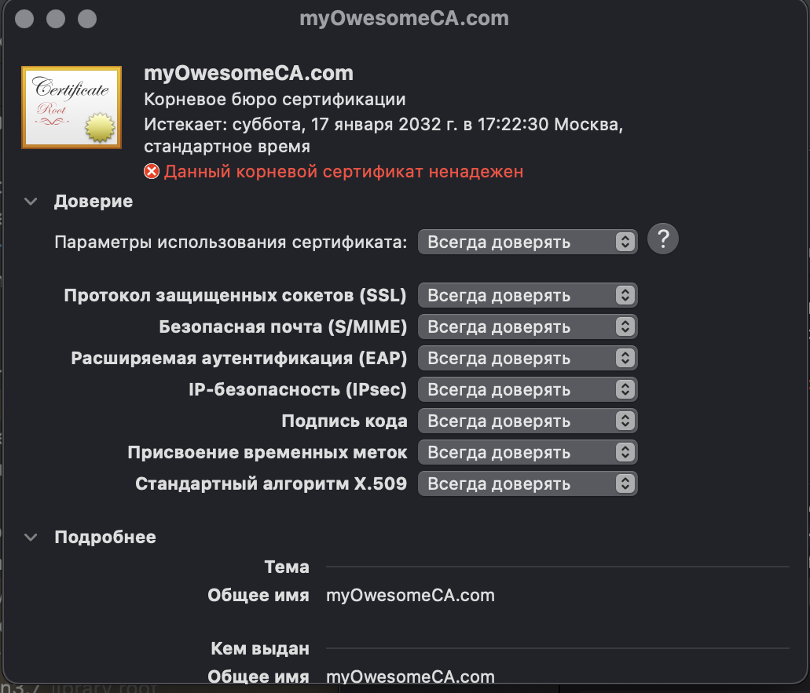
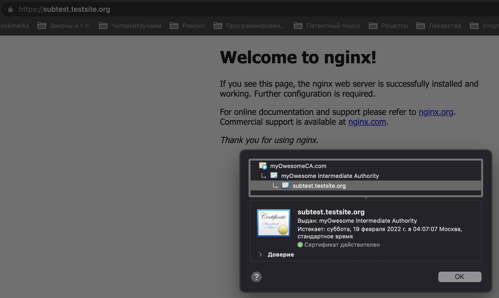

# Курсовая работа по итогам модуля "DevOps и системное администрирование"

Q1: Создайте виртуальную машину Linux.  
A1: 
- в отдельной папке набрал команду `vagrant init hashicorp/bionic64`, получил Vagrantfile с конфигурацией виртуальной машины на основе Linux.
- в Vagrantfile добавим такие настройки
```bash
  config.vm.network "private_network", ip: "192.168.56.4"
```

Q2: Установите ufw и разрешите к этой машине сессии на порты 22 и 443, при этом трафик на интерфейсе localhost (lo) должен ходить свободно на все порты.  
A2:
- ufw уже предустановленна в дистрибутиве ВМ
```bash
vagrant@test:~$ ufw --version
ufw 0.36
Copyright 2008-2015 Canonical Ltd.
```
- добавил правила для ufw и запустил файервол
```bash
vagrant@test:~$ sudo ufw allow in 22
Rules updated
Rules updated (v6)
vagrant@test:~$ sudo ufw allow in 443
Rules updated
Rules updated (v6)
vagrant@test:~$ sudo ufw enable
Command may disrupt existing ssh connections. Proceed with operation (y|n)? y
Firewall is active and enabled on system startup
```

Q3: Установите hashicorp vault
A3: 
- выполнил установку
```bash
vagrant@test:~$ sudo apt-get update && sudo apt-get install vault
```
- проверил
```bash
vagrant@test:~$ vault -v
Vault v1.9.2 (f4c6d873e2767c0d6853b5d9ffc77b0d297bfbdf)
```
- перешел сразу в режим sudo
- согласно инструкции добавил переменные окружения
```bash
root@test:~# export VAULT_ADDR=http://127.0.0.1:8200
root@test:~# export VAULT_TOKEN=root
```

- запустил сервер (сервис) vault в dev-режиме
```bash
root@test:~# vault server -dev -dev-root-token-id root &
[1] 1412
root@test:~# ==> Vault server configuration:

             Api Address: http://127.0.0.1:8200
                     Cgo: disabled
         Cluster Address: https://127.0.0.1:8201
              Go Version: go1.17.5
              Listener 1: tcp (addr: "127.0.0.1:8200", cluster address: "127.0.0.1:8201", max_request_duration: "1m30s", max_request_size: "33554432", tls: "disabled")
               Log Level: info
                   Mlock: supported: true, enabled: false
           Recovery Mode: false
                 Storage: inmem
                 Version: Vault v1.9.2
             Version Sha: f4c6d873e2767c0d6853b5d9ffc77b0d297bfbdf

==> Vault server started! Log data will stream in below:
```
- проверил работу сервера (сервиса)
```bash
root@test:~# vault status
Key             Value
---             -----
Seal Type       shamir
Initialized     true
Sealed          false
Total Shares    1
Threshold       1
Version         1.9.2
Storage Type    inmem
Cluster Name    vault-cluster-8283be2f
Cluster ID      5013e328-6485-c1a3-dd73-4c64d6ffd7a9
HA Enabled      false
```
Q4:
- создаем корневой CA согласно инструкции, указывая TTL=87600h. Проверяем, лег ли сертификат на vault-сервер
```bash
root@test:~# vault secrets enable pki
2022-01-19T14:20:09.357Z [INFO]  core: successful mount: namespace="\"\"" path=pki/ type=pki
Success! Enabled the pki secrets engine at: pki/
root@test:~# vault secrets tune -max-lease-ttl=87600h pki
2022-01-19T14:20:16.404Z [INFO]  core: mount tuning of leases successful: path=pki/
Success! Tuned the secrets engine at: pki/
root@test:~# vault write -field=certificate pki/root/generate/internal common_name="myOwesomeCA.com" ttl=87600h > CA_cert.crt
root@test:~# curl $VAULT_ADDR/v1/pki/ca/pem
-----BEGIN CERTIFICATE-----
MIIDQTCCAimgAwIBAgIUd9qFf7EH8fN4xBZXicScdA/bdZgwDQYJKoZIhvcNAQEL
BQAwGjEYMBYGA1UEAxMPbXlPd2Vzb21lQ0EuY29tMB4XDTIyMDExOTE0MjIwMFoX
DTMyMDExNzE0MjIzMFowGjEYMBYGA1UEAxMPbXlPd2Vzb21lQ0EuY29tMIIBIjAN
BgkqhkiG9w0BAQEFAAOCAQ8AMIIBCgKCAQEAty7K/xDjh3jnaaijxnXTy4HcnRbf
+KsrtOJ+mfiqz3xw4aGhoIeCj59UwlWACMtZCl5hjzD2JVZ6NpKRY+caZqghRKTm
bjq+0HYtmNg2FcoMxBpHORGFbMzvBWkMa0/ULg1tsD0QMqRGATvnOw8W5S1niab9
PPrAaMM27IFWSPeW4W2afQwySt+V1EVXQg9h+pw6K5cS39dcYR7JPU2GzWEqvFSl
WH9DGjF9Z9LRc+y3krqweI9pwOcZPSDIqNLZl/zOwKWZEzYOikya6fs5PRx3ROy9
...
```
- конфигурируем URL для CA и CRL
```bash
root@test:~# vault write pki/config/urls \
>      issuing_certificates="$VAULT_ADDR/v1/pki/ca" \
>      crl_distribution_points="$VAULT_ADDR/v1/pki/crl"
Success! Data written to: pki/config/urls
```
- займемся сертификатом промежуточного CA. Сертификат промежуточного CA подпишем сертифмкатом корневого CA. Подписанный сертификат тоже кладем по выбранному пути. Смотрим, то лежит на vault-сервере
```bash
root@test:~# vault secrets enable -path=pki_int pki
2022-01-19T14:28:13.402Z [INFO]  core: successful mount: namespace="\"\"" path=pki_int/ type=pki
Success! Enabled the pki secrets engine at: pki_int/
root@test:~# vault secrets tune -max-lease-ttl=43800h pki_int
2022-01-19T14:28:33.291Z [INFO]  core: mount tuning of leases successful: path=pki_int/
Success! Tuned the secrets engine at: pki_int/
root@test:~# vault write -format=json pki_int/intermediate/generate/internal common_name="myOwesome Intermediate Authority" | jq -r '.data.csr' > pki_intermediate.csr
vagrant@vagrant:~$ curl http://127.0.0.1:8200/v1/pki_int/ca/pem
-----BEGIN CERTIFICATE-----
MIIDpjCCAo6gAwIBAgIUE5zqSzhCAZ/q4c7yCzjui8h7Qi4wDQYJKoZIhvcNAQEL
BQAwFjEUMBIGA1UEAxMLZXhhbXBsZS5jb20wHhcNMjIwMTE5MDk0OTE2WhcNMjcw
MTE4MDk0OTQ2WjAtMSswKQYDVQQDEyJleGFtcGxlLmNvbSBJbnRlcm1lZGlhdGUg
QXV0aG9yaXR5MIIBIjANBgkqhkiG9w0BAQEFAAOCAQ8AMIIBCgKCAQEAtg3EUhGR
bA4CF5IK7yaL/HZofESeXF+v6SYK+HK1oX+oRkZgEPanPREr1Zc1Unqg+/b00dps
37MfG4leqNa2H4ajbWgvVs8eWkUFbXwb/bhkErtgPY6UFJy+JrF5CrCUgiF8/ezJ
...
```
- подпишем его корневым сертификатом и положим в файл
```bash
root@test:~# root@test:~# vault write -format=json pki/root/sign-intermediate csr=@pki_intermediate.csr format=pem_bundle ttl="43800h" | jq -r '.data.certificate' > intermediate.cert.pem
root@test:~# cat intermediate.cert.pem
-----BEGIN CERTIFICATE-----
MIIDqDCCApCgAwIBAgIUVh5M1CW8YgjCpNSXOkMlnpyJLJkwDQYJKoZIhvcNAQEL
BQAwGjEYMBYGA1UEAxMPbXlPd2Vzb21lQ0EuY29tMB4XDTIyMDExOTE0MzMyNFoX
DTI3MDExODE0MzM1NFowKzEpMCcGA1UEAxMgbXlPd2Vzb21lIEludGVybWVkaWF0
ZSBBdXRob3JpdHkwggEiMA0GCSqGSIb3DQEBAQUAA4IBDwAwggEKAoIBAQDpEOSZ
jLmmataCO0UA6E3sJfnlU+5qoK85EalGYwu8Zj0WJ++aD0AQFquw1QfEcPlJtakn
OxlLoAioY9Pl12pL19SyXE8CNMOWd49NnTrIMd9fnmnyM58bSGxsvFFFVrAWpEo6
/VITUzoc7ydKs3zNZ6R691dPSZHLWgoNmYwm/QFpH0lc7snCfvHV1BPXuAC6BQIv
...
```
- вернем подписанный промежуточный сертификат на сервер vault
```bash
root@test:~# vault write pki_int/intermediate/set-signed certificate=@intermediate.cert.pem
Success! Data written to: pki_int/intermediate/set-signed
```
- создадим роль
```bash
root@test:~# vault write pki_int/roles/testsite-dot-org allowed_domains="testsite.org" allow_subdomains=true max_ttl="730h"
Success! Data written to: pki_int/roles/testsite-dot-org
```
- выпустим сертификат для будущего сервера на имя subtest.testsite.org на основе промежуточного сертификата. Гугл подсказал, что в одном месяце 730 часов, а не 720, как в инструкции. Вывод сделаем в формате json.
```bash
root@test:~# vault write -format=json pki_int/issue/testsite-dot-org common_name="subtest.testsite.org" ttl="730h" > testsite.crt
```
- Вывод запроса на выпуск сертификата запишем в отдельный файл и распарсим его с помощью jq на сертификат (цепочку сертификатов) и приватный ключ.
```bash
root@test:~# cat testsite.crt | jq -r .data.certificate > /etc/ssl/certs/testsite.crt.pem
root@test:~# cat testsite.crt | jq -r .data.ca_chain[] >> /etc/ssl/certs/testsite.crt.pem
root@test:~# cat testsite.crt | jq -r .data.private_key > /etc/ssl/certs/testsite.key
```
запомним, куда сохранили сертификат (цепочку) и ключ для будущего сервера.

Q5:
- корневой сертификат добавим в список доверенных на хостовой машине. Вытащим его из ВМ и вручную отдадим хостовой системе как доверенный.
```bash
leonid@mac vm_vagrant % vagrant ssh -c "sudo cat /root/CA_cert.crt" > vm_CA_cert.crt                                                                                                                                           course_project
Connection to 127.0.0.1 closed.
```




Q6:
- установил nginx

Q7:
- добавил в настройки сервера (/etc/nginx/nginx.conf) параметры сервера для работы по https
```js
http {
...
        server {
                listen 443 ssl default_server;
                listen [::]:443 ssl default_server;
                server_name subtest.testsite.org;
                ssl_certificate /etc/ssl/certs/testsite.crt.pem;
                ssl_certificate_key /etc/ssl/certs/testsite.key;
                ssl_protocols TLSv1 TLSv1.1 TLSv1.2;
                ssl_ciphers HIGH:!aNULL:!MD5;
        }
}
```
- подгрузил новые настройки nginx
```bash
root@vagrant:~# nginx -s reload
```
- попросил утилиту testssl.sh рассказать про 0.0.0.0. Среди прочего получил в ее ответе:
```bash
...
 Certificate Validity (UTC)   expires < 60 days (30) (2022-01-19 15:06 --> 2022-02-19 01:07)
...
```
Q8:
- в хостовой машине добавим в host пару 192.168.56.4 subtest.testsite.org
- через браузер обратимся по адресу subtest.testsite.org
  

### Как же долго я к этому шел:))

Q9:
- теперь, когда что-то (но еще не все) разложилось по полочкам в голове, сделаем скрипт (cert_issue.sh) для получения сертификата для сервера nginx
```bash
#! /bin/bash

rm testsite.crt || 1
vault write -format=json pki_int/issue/testsite-dot-org common_name="subtest.testsite.org" ttl="730h" > testsite.crt
cat testsite.crt | jq -r .data.certificate > /etc/ssl/certs/testsite.crt.pem
cat testsite.crt | jq -r .data.ca_chain[] >> /etc/ssl/certs/testsite.crt.pem
cat testsite.crt | jq -r .data.private_key > /etc/ssl/certs/testsite.key
systemctl restart nginx
exit
```

Q10:
- в crontab добавим такую запись
```bash
0 0 1 * * /root/cert_issue.sh
```
для этого
```bash
root@test:~# crontab -e
```
и там пишем строчку

