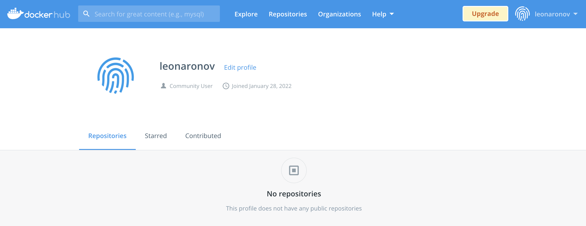
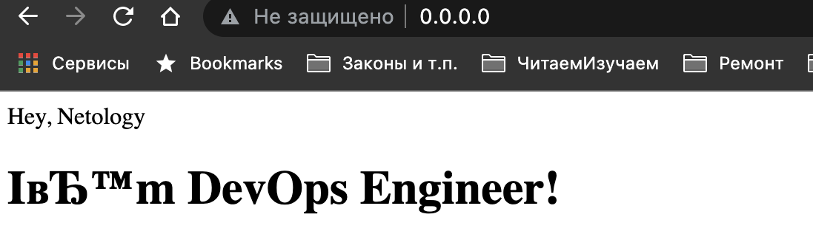

# Домашнее задание к занятию "5.3. Введение. Экосистема. Архитектура. Жизненный цикл Docker контейнера"

Q1:
- создайте свой репозиторий на https://hub.docker.com;  

A1.1:  

- выберете любой образ, который содержит веб-сервер Nginx;  
A1.2:
  - выберем версию на основе alpine  
```bash
leonid@mac netology-DevOps % docker login -u leonaronov                                                                                                                                                                     5-3_Docker_basics
Password:
leonid@mac netology-DevOps % docker pull nginx:1.21.6-alpine
..1.21.6-alpine: Pulling from library/nginx
```
- создайте свой fork образа;  
A1.3:
  - создадим Dockerfile со следующим содержимым
```Dockerfile
FROM nginx:1.21.6-alpine
COPY static /usr/share/nginx/html
EXPOSE 80
```
  - создадим образ контейнера
```bash
leonid@mac docker % docker build -t nginx_netology .                                                                                                                                                                        5-3_Docker_basics
[+] Building 1.6s (7/7) FINISHED
 => [internal] load build definition from Dockerfile                                                                                                                                                                                     0.3s
 => => transferring dockerfile: 111B                                                                                                                                                                                                     0.1s
 => [internal] load .dockerignore                                                                                                                                                                                                        0.2s
 => => transferring context: 2B                                                                                                                                                                                                          0.0s
 => [internal] load metadata for docker.io/library/nginx:1.21.6-alpine                                                                                                                                                                   0.0s
 => [internal] load build context                                                                                                                                                                                                        0.2s
 => => transferring context: 165B                                                                                                                                                                                                        0.0s
 => [1/2] FROM docker.io/library/nginx:1.21.6-alpine                                                                                                                                                                                     0.4s
 => [2/2] COPY static /usr/share/nginx/html                                                                                                                                                                                              0.2s
 => exporting to image                                                                                                                                                                                                                   0.2s
 => => exporting layers                                                                                                                                                                                                                  0.2s
 => => writing image sha256:31bd330411c88c86e2bb0a3590038ac38bfacc2f05def02ae777b5115accb523                                                                                                                                             0.0s
 => => naming to docker.io/library/nginx_netology                                                                                                                                                                                        0.0s
```
---
немного глючный терминал iTerm в плане копипаста stdout
---

- реализуйте функциональность: запуск веб-сервера в фоне с индекс-страницей, содержащей HTML-код ниже:  
```HTML
<html>
<head>
Hey, Netology
</head>
<body>
<h1>I’m DevOps Engineer!</h1>
</body>
</html>
```
A1.4:  
  - в соответствии с содержимым Dockerfile создадим папку `static`, в ней файл `index.html` с предлагаемым содержимым
  - запустим контейнер с пробросом порта 80 (контейнера) на 80 (хоста)
```bash
leonid@mac docker % docker run -idt --name nginx_netology -p 80:80 nginx_netology                                                                                                                                           5-3_Docker_basics
1ef911e32d6354978408b8e0d8d6c33f036c966e676531fee668deba7f9d2566
```
---
Немного глючно, но с кодировкой и экранированием сейчас разбираться не будем


- Опубликуйте созданный форк в своем репозитории и предоставьте ответ в виде ссылки на https://hub.docker.com/username_repo.   
A1.5:
  - публикую рабочий образ (вместе со статическим содержимым) в свой репозиторий на docker hub
```bash
leonid@mac docker % docker tag nginx_netlology/nginx_netology leonaronov/nginx_netology
leonid@mac docker % docker push leonaronov/nginx_netology
Using default tag: latest
The push refers to repository [docker.io/leonaronov/nginx_netology]
```
[I'm DevOps Engineer](https://hub.docker.com/repository/docker/leonaronov/nginx_netology)

---

Q2: Посмотрите на сценарий ниже и ответьте на вопрос: "Подходит ли в этом сценарии использование Docker контейнеров или лучше подойдет виртуальная машина, физическая машина? Может быть возможны разные варианты?"

Детально опишите и обоснуйте свой выбор.

Сценарий:

- Высоконагруженное монолитное java веб-приложение;  
A2.1:  
  - почему нет. Есть готовые базовые образы, есть документация. Я с Java не знаком, но не вижу причин не упаковать в контейнер при условии, что БД или иное хранилище будет во вне!
- Nodejs веб-приложение;  
A2.2:  
  - почему нет. Опять же есть образы с Nodejs, запаковал в контейнер и в оркестр.
- Мобильное приложение c версиями для Android и iOS;  
A2.3:  
  - я бы пока не стал пытаться это даже делать. Дождемся появления поддержки мобильных платформ, а то придется самому создавать свой daemon;
- Шина данных на базе Apache Kafka;  
A2.4:  
  - я честно скажу - загуглить за 1 час я не смог, а тратить еще больше времени на то, чтобы познакомиться с паттернами создания шины данных, оценить, ложится ли на паттерн стек предлагаемых технологий, а потом решить, стоит ли это контейнеризировать - это выглядит задачей не для новичка. Лучше я свой демон docker буду делать для Android:)
- Elasticsearch кластер для реализации логирования продуктивного веб-приложения - три ноды elasticsearch, два logstash и две ноды kibana;  
A2.5:  
  - вы серьезно? Я попытаюсь: кластер... ноды... звучит так, что вопрос масштабирования и изоляции тут уже и так решен. Оставим как есть, пусть работает.
- Мониторинг-стек на базе Prometheus и Grafana;  
A2.6:  
  - мне кажется, что проводить мониторинг состояния сервера ИЗ контейнера - это.... Зачем? Сначала залезть в контейнер, потом вылезти из него (еще придумать как добраться до всех ресурсов хоста), чтобы мониторить хост.
- MongoDB, как основное хранилище данных для java-приложения;  
A2.7:  
  - Лучше выделить просто отдельную ВМ или физический сервер. Не нужно делать прослоек между хранилищем и приложением. БД будет расти в размерах, а если миграция? А еще мы не проходили еще БД.
- Gitlab сервер для реализации CI/CD процессов и приватный (закрытый) Docker Registry.  
A2.8:
  - Насколько я знаю (а я пришел сюда узнать про это еще больше от преподавателей Нетологии), мы в результате получим Docker в Docker'е, хранилище в докере и т.п. Я за разделение функций: Gitlab сервер со всем своим CI/CD пусть будет в контейнере, его мы сбаллансируем в оркестраторе (вы же нас научите), хранилище артефактов сделаем на отдельной ВМ с большим диском (развернем по инструкции от Docker).

  ---

Q3:
- Запустите первый контейнер из образа centos c любым тэгом в фоновом режиме, подключив папку /data из текущей рабочей директории на хостовой машине в /data контейнера;
A3.1:  
```bash
leonid@mac docker % docker run -idt --name=centos_container -v $PWD/data:/data centos
```
- Запустите второй контейнер из образа debian в фоновом режиме, подключив папку /data из текущей рабочей директории на хостовой машине в /data контейнера;
```bash
leonid@mac docker % docker run -idt --name=debian_container -v $PWD/data:/data debian
leonid@mac docker % docker ps
CONTAINER ID   IMAGE     COMMAND       CREATED          STATUS          PORTS     NAMES
2a3631c1251d   centos    "/bin/bash"   5 seconds ago    Up 3 seconds              centos_container
2a431001f1ae   debian    "bash"        16 seconds ago   Up 13 seconds             debian_container
```
- Подключитесь к первому контейнеру с помощью docker exec и создайте текстовый файл любого содержания в /data;
```bash
leonid@mac docker % docker exec -it centos_container bash
[root@2a3631c1251d /]# cd /data
[root@2a3631c1251d data]# touch i_was_here.md
[root@2a3631c1251d data]# exit
```
- Добавьте еще один файл в папку /data на хостовой машине;
```bash
leonid@mac docker % cd data
leonid@mac data % touch host_was_here.md
```
- Подключитесь во второй контейнер и отобразите листинг и содержание файлов в /data контейнера.
```bash
leonid@mac data % docker exec -it debian_container bash
root@2a431001f1ae:/# ls /data -lah
total 4.0K
drwxr-xr-x 4 root root  128 Jan 28 13:39 .
drwxr-xr-x 1 root root 4.0K Jan 28 13:34 ..
\-rw-r--r-- 1 root root    0 Jan 28 13:39 host_was_here.md # пришлось добавить \
\-rw-r--r-- 1 root root    0 Jan 28 13:38 i_was_here.md
root@2a431001f1ae:/# cat /data/i_was_here.md
I'm centos container
root@2a431001f1ae:/# cat /data/host_was_here.md
I'm Mazz...host
```
