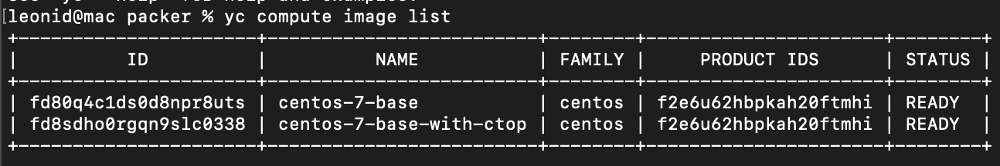
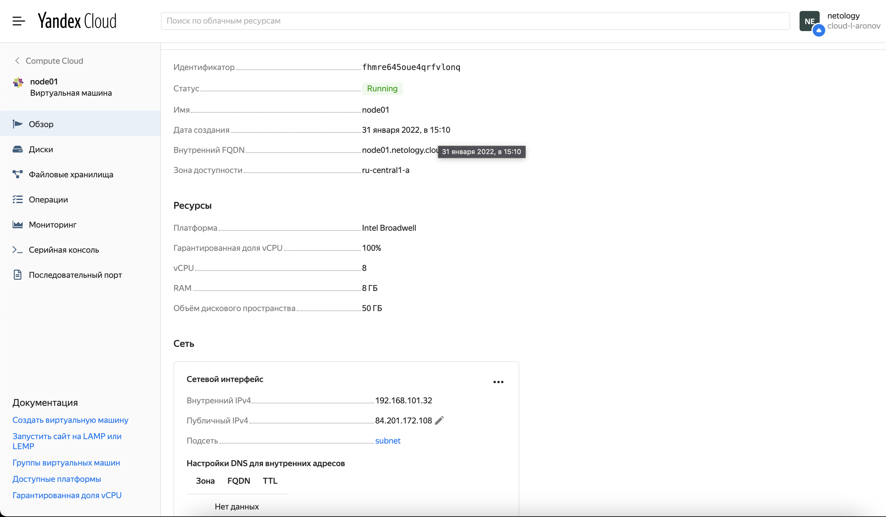
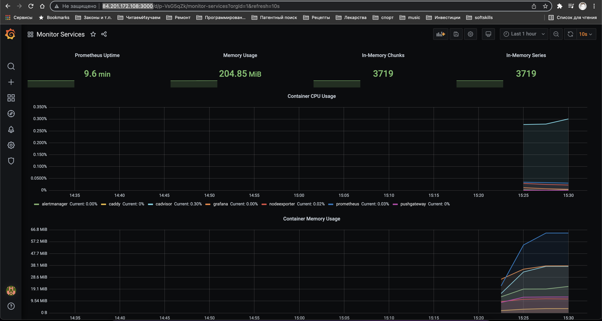

# Домашнее задание к занятию "5.4. Оркестрация группой Docker контейнеров на примере Docker Compose"

Q1:
Создать собственный образ операционной системы с помощью Packer. Повторить результат, полученный на вебинаре и представленный на слайде 37.  
A1: Один образ собрал, действуя параллельно с лектором. Второй создал позже, добавив в образ ctop.

Q2: Создать вашу первую виртуальную машину в Яндекс.Облаке.  
A2: Почитал немного документацию про роли, сервисные аккаунты и создание ключей. Получил key.json.

Q3: Создать ваш первый готовый к боевой эксплуатации компонент мониторинга, состоящий из стека микросервисов.
A3: Все заработало. Вот только ctop я попытался установить наивным yum install ctop среди прочих в Packer конфиге - не вышло:))

