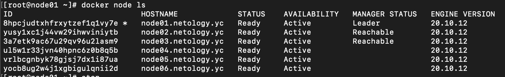
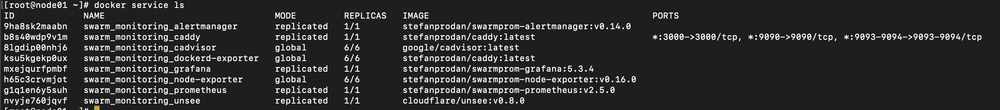

# Домашнее задание к занятию "5.5. Оркестрация кластером Docker контейнеров на примере Docker Swarm"
---
Q1: Дайте письменые ответы на следующие вопросы:

Q1.1: В чём отличие режимов работы сервисов в Docker Swarm кластере: replication и global?  
A1.1: Режим replication - то режим, когда реплики сервиса создаются в `заданном колличестве`, т.е. располагаются на определенном заранее количестве нод (replicas=<N>). Режим global - это режим, при котором сервис распространяется на абсолютно все имеющиеся в кластере ноды.  
Q1.2: Какой алгоритм выбора лидера используется в Docker Swarm кластере?  
A1.2: Алгоритм выбора лидера в кластере Docker Swarm регламентируется протоколом Raft. Если коротко, то алгоритм следующий:
  - ноды в состоянии Follower ждут некоторое время запроса на голосование за лидера. У каждой ноды свой таймер, по истечении таймера нода выдвигает себя в кандидаты на лидеры, т.е. переходит в состояние Candidate
  - в Candidate нода рассылает всем остальным запрос, чтобы они проголосовали за кандидата. Если нода находится в состоянии Follower, то она голосует "За".
  - Когда все ноды (которые могут) проголосовали, по максимуму голосов назначается лидер.
  - Лидер удерживает лидерство за счет рассылки heartbeat-запроса. Получив такой запрос нода в состоянии Follower или Candidate сбрасывает свое состоянии и таймер на ожидание.  

Протокол Raft также регламентирует обновление состояний нод при обработке запроса от клиента сервиса.  
Q1.3: Что такое Overlay Network?  
A1.3: Это логическая сеть, которая создана поверх (overlay) другой сети, например физической. Для организации "общения" узлов в такой сети существуют различные протоколы. Например worker-ноды в Swarm общаются в соответствии с протоколом Gossip, который по сути своей правильнее называть "эпидемическим протоколом".

---
Q2: Создать ваш первый Docker Swarm кластер в Яндекс.Облаке  
A2:
- проверил настройки yc, создал сеть, создал подсеть.
- указал в конфиге для Packer id подсети, id папки в облаке, токен доступа к облаку. Собрал образ для ВМ в облаке YC. Попробовал добавить ctop в образ в соответствии с инструкцией разработчика. Посмотрим:)
- удалил подсеть, удалил сеть (квота на пробном периоде требует). Обновил конфиги для terraform: variables, добавил уже имеющийся key.json). В тасках Ansible, где работает модуль yum, помянял package на name.
- terraform apply-> yes.


- а вот ctop оказался не очень информативен с точки зрения анализа состояния кластера:))) Зато установился:)

---
Q3: Создать ваш первый, готовый к боевой эксплуатации кластер мониторинга, состоящий из стека микросервисов.  
A3:


---
Q4: Выполнить на лидере Docker Swarm кластера команду (указанную ниже) и дать письменное описание её функционала, что она делает и зачем она нужна:
```bash
docker swarm update --autolock=true
```
A4: Хорошее замечание. Как раз думал, что мне несколько не хватает понимания о том, как обеспечить защиту сервиса в облаке. Итак, указанная команда позволяет заблокировать операцию обновления TLS-ключей, которая осуществляется в момент перезагрузки кластера. Могу себе представить такую ситуацию: злодеи вынудили мой облачный сервис перезагрузиться и попытаются перехватить рассылку TLS-ключей между нодами в кластере, чтобы потом вскрыть Raft-логи и вообще трафик между нодами. От этого можно защититься, указанной командой, тогда при перезагрузке кластера придется ввести специальный токен!
