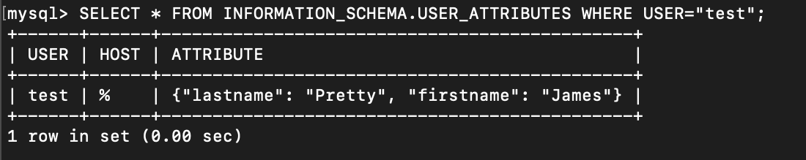

# Домашнее задание к занятию "6.3. MySQL"

Q1:
- Используя docker поднимите инстанс MySQL (версию 8). Данные БД сохраните в volume.  
- Изучите бэкап БД и восстановитесь из него.  
- Перейдите в управляющую консоль mysql внутри контейнера.  
- Используя команду \h получите список управляющих команд.  
- Найдите команду для выдачи статуса БД и приведите в ответе из ее вывода версию сервера БД.  
- Подключитесь к восстановленной БД и получите список таблиц из этой БД.  
- Приведите в ответе количество записей с price > 300.  
- В следующих заданиях мы будем продолжать работу с данным контейнером.  

A1:
- скопировал к себе бэкап БД. Запустил контейнер с MySQL, подключил volume с бэкапом
```bash
leonid@mac 6_3_SQL % docker run --name some-mysql -v $PWD/db_backup:/db_backup -e MYSQL_ROOT_PASSWORD=my-secret-pw -d mysql
```
- зашел в контейнер, зашел в mysql, создал БД test_db, восстановил в нее данные из бэкапа.
- вывод команды, дающей статус БД
```
mysql> \s
mysql  Ver 8.0.28 for Linux on x86_64 (MySQL Community Server - GPL)
...
```
- посмотрел, что лежит в БД test_db

```bash
mysql> SHOW TABLES;
+-------------------+
| Tables_in_test_db |
+-------------------+
| orders            |
+-------------------+
1 row in set (0.01 sec)
```
- количество записей с price>300 равно 1. Получено в результате запроса:
```SQL
mysql> SELECT count(*) FROM orders WHERE price>300;
```

---
Q2: Создайте пользователя test в БД c паролем test-pass, используя:

- плагин авторизации mysql_native_password
- срок истечения пароля - 180 дней
- количество попыток авторизации - 3
- максимальное количество запросов в час - 100
- атрибуты пользователя:
- Фамилия "Pretty"
- Имя "James"
- Предоставьте привелегии пользователю test на операции SELECT базы test_db.

Используя таблицу INFORMATION_SCHEMA.USER_ATTRIBUTES получите данные по пользователю test и приведите в ответе к задаче

A2:
- создал пользователя и наделил его правами
```SQL
CREATE USER IF NOT EXISTS
  test
  IDENTIFIED WITH mysql_native_password BY "test-pass"
  WITH MAX_QUERIES_PER_HOUR 100
  PASSWORD EXPIRE INTERVAL 180 DAY
  FAILED_LOGIN_ATTEMPTS 3
  ATTRIBUTE '{"firstname": "James", "lastname": "Pretty"}';
GRANT SELECT ON test_db.* TO test;
```


---
Q3:
- Установите профилирование SET profiling = 1. Изучите вывод профилирования команд SHOW PROFILES;.

- Исследуйте, какой engine используется в таблице БД test_db и приведите в ответе.

  A3.2:
  - командой `show table status;` получаем InnoDB в качестве Engine.  

- Измените engine и приведите время выполнения и запрос на изменения из профайлера в ответе:

  - на MyISAM
  A3.3.1:  
  ```SQL
  ALTER TABLE test_db.orders ENGINE = MyISAM;
  ```
  Время выполнения запроса составило 0.17571250 сек.  

  - на InnoDB
  A3.3.2:
  ```SQL
  ALTER TABLE test_db.orders ENGINE = MyISAM;
  ```
  Время выполнения запроса составило 0.12802400 сек.

---
Q4:
Изучите файл my.cnf в директории /etc/mysql. Измените его согласно ТЗ (движок InnoDB):

- Скорость IO важнее сохранности данных
- Нужна компрессия таблиц для экономии места на диске
- Размер буффера с незакомиченными транзакциями 1 Мб
- Буффер кеширования 30% от ОЗУ
- Размер файла логов операций 100 Мб
- Приведите в ответе измененный файл my.cnf.

A4:
```bash
root@997f4930c2a4:/etc/mysql# cat my.cnf
# Copyright (c) 2017, Oracle and/or its affiliates. All rights reserved.
#
# This program is free software; you can redistribute it and/or modify
# it under the terms of the GNU General Public License as published by
# the Free Software Foundation; version 2 of the License.
#
# This program is distributed in the hope that it will be useful,
# but WITHOUT ANY WARRANTY; without even the implied warranty of
# MERCHANTABILITY or FITNESS FOR A PARTICULAR PURPOSE.  See the
# GNU General Public License for more details.
#
# You should have received a copy of the GNU General Public License
# along with this program; if not, write to the Free Software
# Foundation, Inc., 51 Franklin St, Fifth Floor, Boston, MA  02110-1301 USA

#
# The MySQL  Server configuration file.
#
# For explanations see
# http://dev.mysql.com/doc/mysql/en/server-system-variables.html

[mysqld]
pid-file        = /var/run/mysqld/mysqld.pid
socket          = /var/run/mysqld/mysqld.sock
datadir         = /var/lib/mysql
secure-file-priv= NULL

# Custom config should go here
!includedir /etc/mysql/conf.d/
innodb_buffer_pool_size = 600Mb
innodb_log_file_size = 100Mb
innodb_log_buffer_size = 1Mb
innodb_file_per_table = true
innodb_flush_method=O_DSYNC
innodb_flush_log_at_trx_commit = 2
query_cache_size = 0
```
