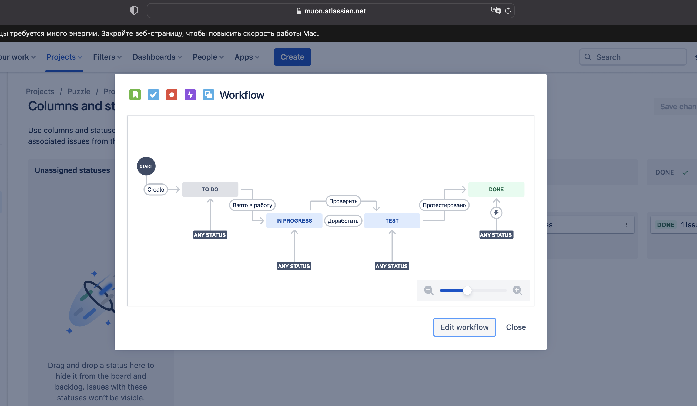

# Домашнее задание к занятию "09.01 Жизненный цикл ПО"

С учетом всех сложностей и послаблений сделал следующее:

- Договорился с тимлидом по сайдпроекту, что буду вести спринты по проекту сам -> получил разрешение создать свой проект.
- Создал проект по шаблонам SCRUM, добавил статус TEST.
- Настроил правила переходов между статусами, добавил новые переходы и получил то, что ниже

Теперь будем работать.
